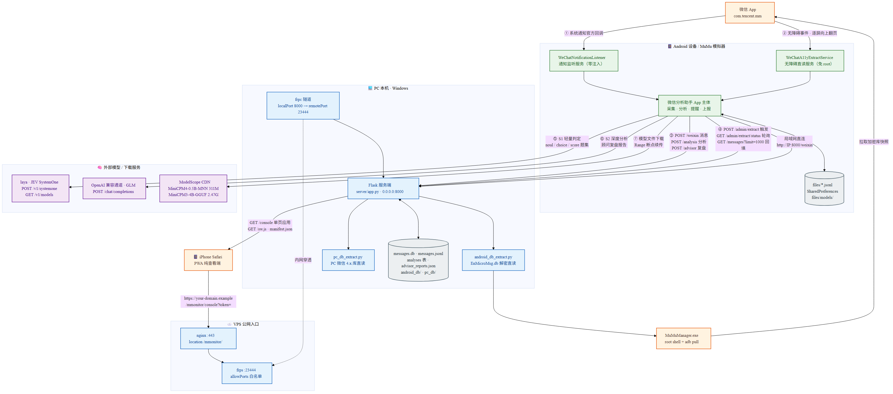
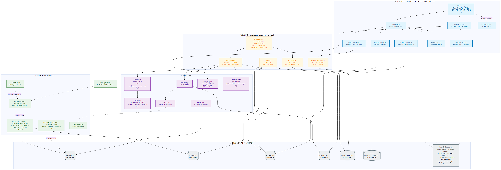
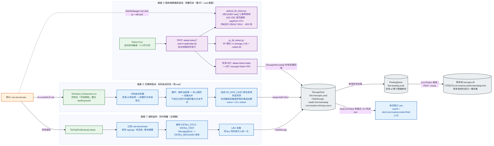
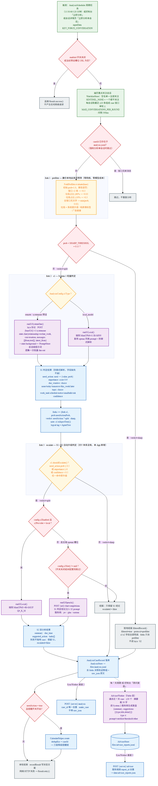
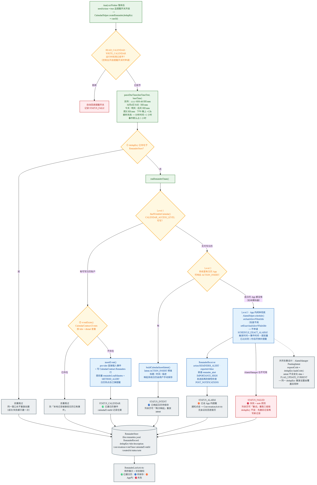
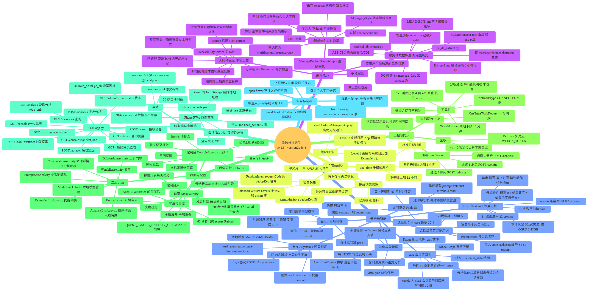
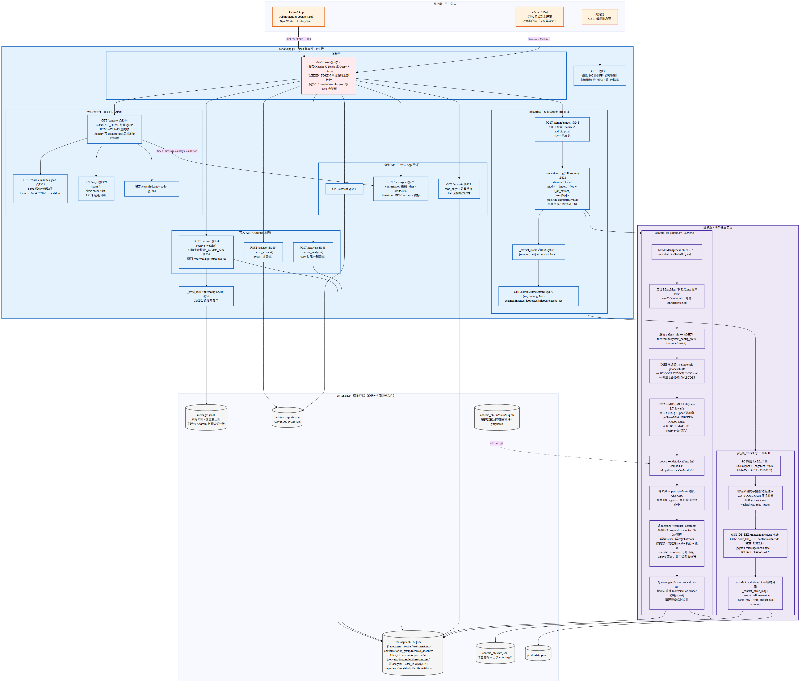
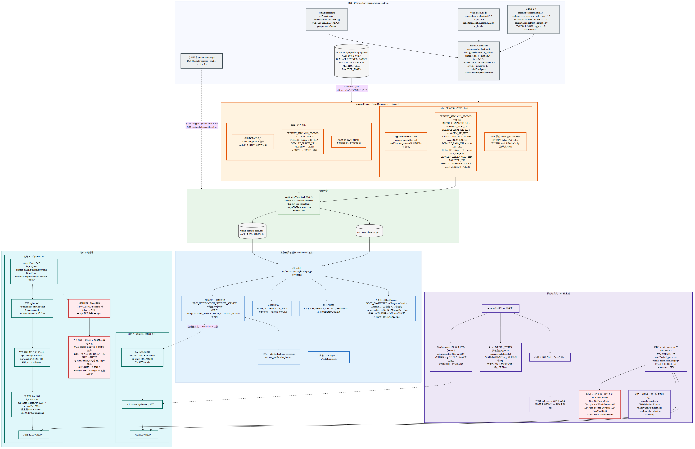
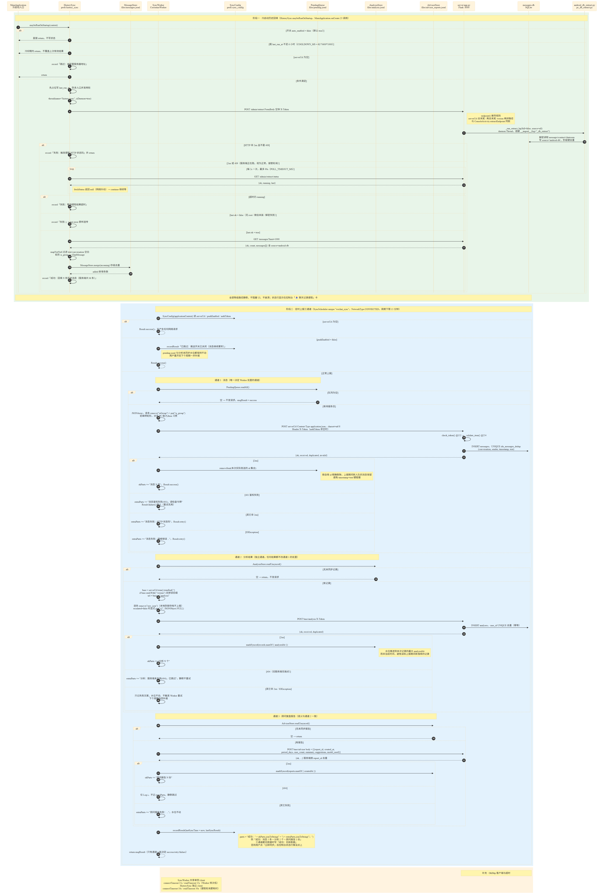

# 微信分析助手 · 架构与功能图集

> 本目录是对 `C:\project\qiyeweixin\weixin_android` **现有代码**的逆向梳理成果，不是设计提案。
> 所有节点、类名、方法名、常量、行号、路径均来自实际源码与配置文件。
>
> - 绘制方式：Mermaid 源文件（`diagrams/*.mmd`）→ `@mermaid-js/mermaid-cli@11.17.0` 光栅化
> - 每张图三份产物：`.mmd`（可编辑源）· `.png`（原生分辨率，14px 中文字体）· `.svg`（无限缩放，浏览器打开）
> - 中文字体：`Microsoft YaHei, PingFang SC, sans-serif`（Windows 由 `msyh.ttc` 提供）
> - 代码基线：`versionName 0.1.3` / `versionCode 4`，40 个 Kotlin 文件 + `server/app.py` 1491 行

---

## 图集索引

| # | 图 | 回答的问题 | 尺寸 (px) |
|---|---|---|---|
| 01 | [系统上下文](#01-系统上下文) | 这个系统和谁说话？数据往哪流？ | 3194 × 1389 |
| 02 | [Android 分层架构](#02-android-分层架构) | 40 个 Kotlin 文件各自属于哪一层？ | 4966 × 1692 |
| 03 | [三条采集通道](#03-三条采集通道) | 消息是怎么进来的？为什么需要三条路？ | 3087 × 915 |
| 04 | [分析决策流水线](#04-分析决策流水线) | 一条消息如何变成一条待办？ | 1010 × 4995 |
| 05 | [三级降级提醒链](#05-三级降级提醒链) | 提醒为什么不会丢？ | 1999 × 3051 |
| 06 | [功能全景脑图](#06-功能全景脑图) | 这个 App 到底有哪些功能？ | 2738 × 1357 |
| 07 | [服务端架构](#07-服务端架构) | Flask 单文件里装了什么？ | 3819 × 3254 |
| 08 | [构建与部署](#08-构建与部署) | 从源码到手机、从手机到公网的完整链路 | 4387 × 2753 |
| 09 | [同步时序](#09-同步时序) | 冷启动回填与三通道上报的精确行为 | 4148 × 6143 |

---

## 01 系统上下文

四个信任域 + 两个外部服务。核心事实：**Android 端只负责"看见"和"上报"，所有重活（数据库解密直读）都在 PC 宿主机执行**，因为模拟器才有 MuMu root 通道。



- 📱 **Android 设备 / MuMu 模拟器** — `WeChatNotificationListener`（通知监听，零注入）+ `WeChatA11yExtractService`（无障碍直读，免 root）+ App 主体 + 私有目录存储
- 💻 **PC 本机 Windows** — `server/app.py` Flask `0.0.0.0:8000`、`android_db_extract.py`、`pc_db_extract.py`、`messages.db`、frpc 隧道（localPort 8000 → remotePort 23444）
- ☁️ **VPS 公网入口** — nginx `:443` `location /mmonitor/` → frps `:23444`（allowPorts 白名单）
- 🧠 **外部模型** — laya/JEV `POST /v1/systemone`、OpenAI 兼容通道 `POST /chat/completions`、ModelScope CDN（MiniCPM4-0.5B-MNN 311MB / MiniCPM3-4B-GGUF 2.47GB）
- 📱 **iPhone Safari** — PWA 纯查看端。iOS 没有 NotificationListenerService 等价物，不能采集，只能看

七条编号链路（① 系统通知官方回调 → ⑦ 模型文件下载）在图中逐条标注。

---

## 02 Android 分层架构

五层 + Application 入口。**刻意不引 Compose**：全部传统 View + RecyclerView，第三方依赖压到 4 个（core-ktx / recyclerview / work-runtime-ktx / okhttp），把首次构建失败风险降到最低。JSON 用平台内置 `org.json`，不引 Gson/Moshi。



| 层 | 内容 |
|---|---|
| ① UI 层 | 9 个 Activity：Main（首页）· Console（控制台 8 卡）· Conversation（会话详情+分析面板）· AnalysisList · Watchlist · ReminderList · PromptEdit · ModelList · Onboarding |
| ② 采集与常驻层 | `WeChatNotificationListener` · `WeChatA11yExtractService` · `KeepAliveService`（60s 看门狗 requestRebind）· `BootReceiver` · `ReminderReceiver` |
| ③ 后台任务层 | 4 个 Worker：Sync（三通道上报）· Analysis（逐会话窗口 case）· Advisor（近 7 天复盘）· ModelDownload（.part 断点续传）；3 个 Scheduler 全部 `enqueueUniquePeriodicWork` + UPDATE 策略 |
| ④ 领域 / 决策层 | `AnalysisCase` · `ForkPrefilter` · `CalendarHelper` · `AlarmHelper` · `MessageReplier` · `HistorySync` · `LocalLlmEngine` |
| ⑤ 存储层 | 6 个 JSONL/目录 + 12 个 SharedPreferences 文件（见下方存储清单） |

**本地存储全清单**

```
files/messages.jsonl            MessageStore.kt:66       采集到的消息
files/pending.jsonl             PendingQueue.kt:43       待上报队列（自增 id 精确剔除）
files/analysis.jsonl            AnalysisStore.kt:193     case 分析记录 + forks 决策轨迹
files/reminders.jsonl           ReminderStore.kt:84      提醒记录
files/advisor_reports.jsonl     AdvisorStore.kt:93       顾问复盘报告
files/models/{modelId}/         LocalModelStore          端侧模型文件 + .part 续传

prefs analysis_config           AnalysisConfig.kt:24     分析预设/槽位/协议/Basic 账号
prefs sync_config               SyncConfig.kt:18         服务器地址/令牌/周期
prefs analysis_sync             AnalysisStore.kt:196     分析上报水位
prefs advisor_store             AdvisorStore.kt:96       顾问上报水位
prefs watchlist                 WatchlistStore.kt:18     重点关注名单（含 SENTINEL_NONE）
prefs prompt_config             PromptStore.kt:16        会话级自定义提示词
prefs history_sync              HistorySync.kt:32        自动提取开关/冷却/状态
prefs a11y_extract              A11yExtractStore.kt:16   无障碍提取运行态
prefs keepalive_state           KeepAliveService.kt:37   保活状态
prefs local_model_store         LocalModelStore.kt:24    模型清单与下载进度
prefs collapse_state            MainActivity.kt:997      首页折叠状态
prefs app_state                 OnboardingActivity.kt:29 向导完成标记
```

全部落在 app 私有目录，**卸载即删**。

---

## 03 三条采集通道

三条通道不是冗余，是三种能力边界互补。横向读图。



| 通道 | 机制 | 覆盖范围 | 代价 / 限制 |
|---|---|---|---|
| ① 通知监听（主链路） | 官方 `NotificationListenerService`，包名过滤 `com.tencent.mm`，丢弃 ongoing/聚合摘要，`EXTRA_MESSAGES` 逐条解析发言人，LRU 去重 | 实时增量 | 免打扰群与前台会话**不产生通知**→ 完全不可见；拿不到服务启动前的历史；`EXTRA_TEXT` 可能只是"3 条新消息"摘要 |
| ② 无障碍直读 | `AccessibilityService`，控制台点「开始提取」后自动跳回微信，逐屏向上翻页去重合并，连续 `NO_NEW_LIMIT` 屏无新增判定到顶 | 本机会话历史，**免 root** | 时间戳只能按采集顺序每秒递减**估算**（记录标 `source=a11y-extract`）；微信改版会导致 UI 碎裂，靠 resource-id 候选表 + 最大面积文本节点启发式 + 整屏文本行兜底三级降级 |
| ③ 服务端数据库直读 | `android_db_extract.py` / `pc_db_extract.py`，在 PC 上解密微信本地库 | **完整历史**，含自己发出的消息 | 需要 MuMu root 通道（仅 MuMu 12）；微信版本相关（已验证 8.0.78）；只有文本，媒体是占位符 |

**反向写出路径（不在本图中，因为它是唯一的"写"方向）**：`MessageReplier` 用微信通知自带的「直接回复」`Notification.Action` + `RemoteInput`，把文本塞进 results Bundle 后发送该 action 的 `PendingIntent`——等价于用户在通知栏手打发送。**全部系统公开 API，无注入/hook/协议**。边界：仅用户手动触发的单条回复，禁止自动群发；执行的是微信自己的 PendingIntent，本 App 无法伪造会话。回复失败的一种典型原因是通知已被划掉（PendingIntent 失效）。

---

## 04 分析决策流水线

纵向长图，从上往下读。核心设计：**分析单位是"会话窗口"而不是"单条消息"**，一个 case = 某关注会话最近 ≤10 条消息，`caseId = sha1(conversation|windowEnd)[:16]`——窗口没变就不重复分析。



三个 fork 逐级过滤，越往下越贵：

- **fork 1 · prefilter**（`ForkPrefilter.kt`，零网络零模型）— 初始 `prob=1.0`，乘性惩罚：窗口 <2 条 ×0.3；垃圾占比 ≥80% ×0.05、≥50% ×0.3；全窗口无文字 → `min(prob, 0.02)`。垃圾 = 系统提示语 / 纯表情标签 / 广告链接。`prob < SHARP_THRESHOLD (0.15)` → 就地结案 `filtered=true`，**不调 laya、不调 S2**。约束：只减不增
- **fork 2 · s1**（System 1 轻量判定）— laya 协议 `POST /v1/systemone`，题集 `noul / choice / score` 一次批量 fan-out：`need_action`(noul) · `importance`(score 0-9) · `due_window`(choice) · `topic`(choice)。或走端侧 `runS1Local()` MiniCPM4-0.5B-MNN。防御式解析，字段缺失不崩
- **fork 3 · escalate**（S1→S2 自动升级，**JEV 体系没有、本 App 新增**）— `need_action prob ≥ 0.5` 或 `importance ≥ 6` 或 `confidence < 0.5`，任一命中即升级。S1 结论注入 S2 prompt，`POST {url}/chat/completions`（jev / glm / custom）或端侧 MiniCPM3-4B-GGUF。**S2 失败不拖垮 case**：保留 S1 结论，`escalated=false`

每步决策都写进 `forks` 数组，logcat tag = `AgentTree`，可 grep 复盘单条消息为什么被判成待办/非待办。

落库后两条出口：`needAction=true` 且提醒开关开启 → `CalendarHelper.createReminder(dedupKey=caseId)`；`SyncWorker` 通道 2 → `POST {server}/analysis`。

旁支 **AdvisorWorker（Fable 层）**：每 7 天或手动触发，通读近 7 天 case（≤50 个，摘要截 30 字），调 System 2 服务商产出 `{summary, suggestions:[{type,title,detail}]}`，`type ∈ prompt/watchlist/threshold/other`。纯增量功能，失败不影响主链路。

---

## 05 三级降级提醒链

设计目标：**提醒必须可达**。设备上有什么就用什么，一路降级到 App 自己弹通知。



| 级别 | 触发条件 | 动作 | 落地状态 |
|---|---|---|---|
| Level 1 | `findWritableCalendar()` 找到 `CALENDAR_ACCESS_LEVEL` 可写的日历账户 | provider 直接 `insertEvent()` **并**写 `CalendarContract.Reminders` 行（提前量 + `METHOD_ALERT`），让日历自己到点弹提醒 | `STATUS_CALENDAR` 🟢 已建日历事件 |
| Level 2 | 无可写账户，但系统里有日历 App 能响应 `ACTION_INSERT` | `buildCalendarInsertIntent()` 预填标题/时间/描述，唤起系统日历由用户手动保存 | `STATUS_INTENT` 🔵 已唤起日历待保存（列表页可「再次唤起」重放 intent） |
| Level 3 | 连日历 App 都没有（本模拟器即此情况） | `AlarmHelper.schedule()` → `setAndAllowWhileIdle`。触发时间 = 事件时间 − 提前量；已过点则 1 秒后补提醒 | `STATUS_ALARM` 🟠 已设 App 内提醒（通知点击 → ConversationActivity） |
| 兜底 | AlarmManager 也不可用 | 记录失败原因 | `STATUS_FAILED` 🔴 失败（列表页可「重试」重跑三级链） |

**双重防重**

1. `ReminderStore` 先查 `dedupKey`（= caseId 指纹）——同一窗口永不重复创建，成功/失败都只建一次
2. Level 1 再用 `eventExists()` 按 `title + dtstart` 查 `CalendarContract.Events`——防"本地 reminders.jsonl 被删但日历里事件还在"

**两个刻意的取舍**

- `setAndAllowWhileIdle` 而**不是** `setExactAndAllowWhileIdle` → 不申请 `SCHEDULE_EXACT_ALARM`，接受 Doze 下数分钟漂移
- `PendingIntent.requestCode = dedupKey.hashCode()`，intent 不含变化 data + `FLAG_UPDATE_CURRENT` → 同一 dedupKey 重复设置自然覆盖旧闹钟，天然去重

`parseDueTime()` 支持 `yyyy-MM-dd HH:mm` / `M月d日H点` / `HH:mm` / `今天|明天|后天 HH:mm` / `周X HH:mm` / `下午|晚上` +12h；解析失败回退"分析时间 +1 小时"；事件默认占 1 小时。

---

## 06 功能全景脑图

七大功能域、约 180 个叶子节点，是全部功能的一次性清单。



`采集能力` · `分析与智能` · `提醒与触达` · `上报与同步` · `界面与配置` · `服务端与查看端` · `安全与边界`

**控制台（ConsoleActivity）八张卡片**，对应 `activity_console.xml`：

| # | 卡片 | 布局行 | 主要控件 |
|---|---|---|---|
| 1 | 💬 微信对接状态 | L65 | `btnConsoleGrant`(L84) · `btnReopenOnboarding`(L95) |
| 2 | ⭐ 重点关注会话 | L120 | `btnOpenWatchlist`(L134) |
| 3 | 📤 定时上报到服务器 | L157 | `sync_push_switch`(L167) · `btnSaveSync`(L226) · `btnSyncNow`(L237) |
| 4 | 📥 聊天记录提取 | L270 | `btnExtractNow`(L284) · `extract_auto_switch`(L299) |
| 5 | 📱 本机无障碍直读（无需 root） | L332 | `btn_a11y_permission`(L352) · `btn_a11y_start`(L369) · `btn_a11y_stop`(L381) |
| 6 | 🧠 后端分析（S1 + S2） | L407 | `analysis_enabled_switch`(L417) · `s2_enabled_switch`(L540) · `btnTestConnection`(L653) · `btnAnalysisNow`(L666) · `btnOpenModels`(L688) |
| 7 | 🧭 顾问复盘 | L727 | `advisor_auto_switch`(L737) · `btnAdvisorNow`(L742) |
| 8 | 📅 日历提醒 | L782 | `reminder_enabled_switch`(L792) · `btnOpenReminders`(L826) |

**重点关注名单的三态语义**（`WatchlistStore`）：空名单 = 关注全部（默认，零配置即全量分析）；非空 = 只关注列出的；`SENTINEL_NONE` 占位串（不可能与真实会话名相同）= 一个都不关注。在"关注全部"状态下首次取消勾选，会把名单物化为"当前全集减去被取消的"。

**会话级自定义提示词**（`PromptStore` / `PromptEditActivity`）：按会话名存，空白 = 用全局默认。注入三处——S1 systemone 的 `state.background`（服务端 4xx 拒绝时降级为不带 background 重试）、S1 openai 槽位 system prompt 的「背景信息」段、S2 prompt。编辑页有 3 个内置模板，点击整体替换编辑器内容。占位符 `{我}` / `{重要的人}` / `{关系}` 由用户手改——**刻意不做变量表单**，把提示词全文的控制权留给用户。

---

## 07 服务端架构

`server/app.py` 单文件 1491 行 Flask，依赖只有 `flask==3.1.3`。



**路由全表**（含行号）

| 方法 | 路径 | 处理函数 | 说明 |
|---|---|---|---|
| POST | `/weixin` | `receive_weixin` @174 | 接收消息数组，返回 `{ok, received, duplicated, invalid}` |
| GET | `/messages` | `query_messages` @277 | `conversation` 模糊 / `date` / `limit`≤1000，timestamp DESC |
| POST | `/analysis` | `receive_analysis` @349 | `case_id` 唯一键去重 |
| GET | `/analysis` | `query_analysis` @439 | `todo_only=1` 只看待办，s1/s2 反解析为对象 |
| POST | `/advisor` | `receive_advisor` @530 | `report_id` 去重 |
| GET | `/advisor` | `query_advisor` @585 | |
| POST | `/admin/extract` | `admin_extract` @649 | `full=1` + `source ∈ android\|pc\|all`，409 = 已在跑 |
| GET | `/admin/extract/status` | `admin_extract_status` @680 | `{ok, running, last}` |
| GET | `/console` | `console_page` @1345 | PWA 单页，HTML/CSS/JS 全内联在 `CONSOLE_HTML` @705 |
| GET | `/console/manifest.json` | @1355 | 免鉴权 |
| GET | `/console/icons/<path>` | @1361 | |
| GET | `/sw.js` | `console_sw` @1370 | 免鉴权；骨架 cache-first，API 永远走网络 |
| GET | `/` | `index` @1382 | 极简网页，最近 100 条倒序 |

**鉴权**：`check_token()` @152 接受 Header `X-Token` **或** Query `?token=`。设置 `WEIXIN_TOKEN` 后除 `/console/manifest.json` 与 `/sw.js` 外全部需要鉴权。

**数据库 schema**（`init_db` @74）

```sql
CREATE TABLE messages (
  id INTEGER PRIMARY KEY AUTOINCREMENT,
  sender TEXT, text TEXT, timestamp INTEGER,
  conversation TEXT, is_group INTEGER, received_at INTEGER
);
CREATE UNIQUE INDEX idx_messages_dedup ON messages (conversation, sender, timestamp, text);
-- 迁移追加：source TEXT NOT NULL DEFAULT 'android-notification'
--          取值 android-notification / android-db / pc-db

CREATE TABLE analyses (
  id INTEGER PRIMARY KEY AUTOINCREMENT,
  case_id TEXT UNIQUE, conversation TEXT, window_end INTEGER,
  message_count INTEGER, need_action INTEGER, importance TEXT,
  escalated INTEGER, s1 TEXT, s2 TEXT, analyzed_at TEXT,
  protocol TEXT, received_at INTEGER
);
-- 迁移追加：forks TEXT（JSON 数组 [{fork,prob,verdict,note}]）
--          filtered INTEGER NOT NULL DEFAULT 0
```

**提取编排**：`_extract_status = {"running": False, "last": None}` 内存态 + `_extract_lock`；`_run_extract_bg(full, source)` @622 起 daemon Thread，逐腿 `mod = __import__(leg + "_db_extract")` → `mod.run_extract(full=full)`。**单腿失败不拖垮另一腿**，整体 ok = 至少一腿不是 `ok is False`。

**安卓库解密参数对比**

| | PC 微信 4.x | 安卓微信 |
|---|---|---|
| 库文件 | `Msg*.db`（`message/message_0.db`） | `EnMicroMsg.db` |
| 加密 | SQLCipher 4 | WCDB2 / SQLCipher 页加密 |
| 密钥来源 | 内存搜索 / 进程注入 | `MD5(IMEI + str(uin))[:7].lower()` 离线推导 |
| pageSize | 4096 | 1024 |
| KDF | PBKDF2-HMAC-SHA512，256000 轮 | PBKDF2-HMAC-SHA1，4000 轮 |
| HMAC | 开 | 关，reserve=16（仅 IV） |
| 取库方式 | 本地文件直读 | MuMuManager root shell `cp` + `adb pull` |

**安卓提取七步**（全部运行时探测，无硬编码账号信息）：`MuMuManager.exe sh -v 0 -c` 拿 root shell（adb shell 无 su）→ 定位 `MicroMsg/` 下 32 位 hex 账户目录（= `md5("mm"+uin)`）→ 从 MMKV `files/mmkv/system_config_prefs` 解析 `default_uin`（protobuf varint）→ IMEI 候选链 `service call iphonesubinfo` → `WLOGIN_DEVICE_INFO.xml` → 兜底 `1234567890ABCDEF` → root `cp` 到 `/data/local/tmp` + `chmod 644` + `adb pull` → 纯 Python pycryptodome 逐页 AES-CBC 解密，用第 1 页 page-size 字段验证密钥命中 → 读 `message`/`rcontact`/`chatroom` 三表合并入库。

**跨源去重**：两个来源的毫秒时间戳不一致，故归一化到 `(conversation, sender, 秒级timestamp, text)`；已存在行与批内重复都跳过。通知来源的重试去重仍由原毫秒级唯一索引兜住。增量游标在 `data/android_db/state.json`（上次 max msgId）。

**PWA 查看端**：`?token=` 写入 localStorage 后从地址栏抹除，后续请求自动带 `X-Token`。三个 Tab——会话（按会话分组，头部计数 + 最新预览 + ⚡待办角标，点卡片展开，待办会话内联 S1 chips 与 S2 区）/ 待办（全部 `need_action=true`，高重要度标红）/ 统计（消息总数、来源分布、已分析会话数、最后上报时间）。30 秒自动刷新，全内联无 CDN，**数据永不缓存，只缓存页面骨架**。

---

## 08 构建与部署



**构建**：AGP 8.5.2 + Kotlin 2.0.20，compileSdk 34 / minSdk 26 / targetSdk 34，Java 17。仓库**不含 gradle-wrapper jar**，首次需 `gradle wrapper --gradle-version 8.9`，然后 `gradlew.bat assembleDebug`。

**两个 flavor**（`flavorDimensions += "channel"`）

| | `open`（对外发布） | `beta`（内部测试，产品名 test） |
|---|---|---|
| applicationId | `com.qiyeweixin.weixin_android` | + `.test` 后缀 |
| versionName | `0.1.3` | `0.1.3-test` |
| 桌面名 | 微信分析助手 | 微信分析助手·测试 |
| `DEFAULT_*` buildConfigField | **全部空串**，APK 内不含任何密钥 | 从 `secrets.local.properties` 经 `secret(key)` 读取，`bcString(value)` 转义反斜杠与引号 |
| 产物 | `weixin-monitor-open.apk` | `weixin-monitor-test.apk` |

beta 注入：`DEFAULT_ANALYSIS_PROTOCOL="openai"`、`GLM_BASE_URL`/`GLM_API_KEY`/`GLM_MODEL`、`JEV_URL`/`JEV_API_KEY`、`MONITOR_URL`/`MONITOR_TOKEN`。首次启动 seed 进配置（仅填充，可改）。

> AGP 禁止 flavor 名以 `test` 开头，故内部名 `beta`、产品名 `test`。桌面名加后缀是因为用户曾把 open 包误认成 test 包，报"没有预置模型、没有历史回填"——那是 open 的设计行为。

**设备安装后的四道授权**（都是系统级手动开关，不能运行时申请）

1. 通知监听 `BIND_NOTIFICATION_LISTENER_SERVICE` → `Settings.ACTION_NOTIFICATION_LISTENER_SETTINGS`；验证 `adb shell settings get secure enabled_notification_listeners`
2. 无障碍服务 `BIND_ACCESSIBILITY_SERVICE` → 系统设置 → 无障碍
3. 电池白名单 `REQUEST_IGNORE_BATTERY_OPTIMIZATIONS` → 首页 `btnBatteryWhitelist`
4. 开机自启 `BootReceiver` → `KeepAliveService`。Android 12+ 后台起 FGS 会抛 `ForegroundServiceStartNotAllowedException`，**这是预期失败**，捕获记日志即可；兜底是"来微信通知时系统自动 bind 监听器 + 60s 看门狗 `requestRebind`"

**服务端启动**：`server\启动服务.bat` 做三件事——① `set WEIXIN_TOKEN`（真值在 gitignored `secrets.local.bat`；改令牌必须同步改 App 的「访问令牌」并重按「保存并启用定时上报」，否则 401）② `adb connect 127.0.0.1:16384` + `adb reverse tcp:8000 tcp:8000`（模拟器内 `http://127.0.0.1:8000` 直达宿主，免局域网 IP 与防火墙）③ 前台跑 Flask，Ctrl+C 停。**`adb reverse` 存活于 adbd，模拟器重启即失效，每次重跑 bat。**

**两条访问链路**

```
链路 A（局域网/模拟器）
  App → http://127.0.0.1:8000/weixin → adb reverse → Flask 0.0.0.0:8000

链路 B（公网 HTTPS）
  App / iPhone PWA
    → https://your-domain.example/mmonitor/weixin
    → VPS nginx :443   /etc/nginx/sites-enabled/mmonitor  location /mmonitor/
    → VPS 127.0.0.1:23444   frps  /etc/frps/frps.toml  allowPorts 必须含 23444
    → 宿主机 frpc   frpc/frpc.toml  localPort 8000 → remotePort 23444
    → Flask 127.0.0.1:8000
```

**三处配置必须保持同步**（frpc.toml / frps.toml allowPorts / nginx location）。排障顺序：Flask 存活（`127.0.0.1:8000/messages` 带 token → 200）→ frpc 隧道在跑 → nginx。frpc 热重载：`curl -u admin:... http://127.0.0.1:7400/api/reload`（GET）。

**安全红线**：默认定位局域网/自控服务器；Flask 内置服务器不用于高并发生产；公网必须 `WEIXIN_TOKEN`（长随机）+ HTTPS；可 caddy/nginx 反代或 frp，绝不裸奔；令牌当密码，永不提交；`messages.jsonl` / `messages.db` 含聊天原文，注意存储与备份安全。`android:usesCleartextTraffic="true"` 仅为局域网调试。

---

## 09 同步时序

两个阶段：冷启动历史回填 + 定时三通道上报。逐条对齐 `HistorySync.kt` 与 `SyncWorker.kt` 源码。



**阶段一 · 冷启动回填**（`MainApplication.onCreate:23` 调 `HistorySync.maybeRunOnStartup`）

四道闸门，任一不满足即静默跳过：`auto_enabled=false`（默认 true）→ 距 `last_run_at` 不足 6 小时（`COOLDOWN_MS`，冷却期内**不写状态**，避免覆盖上次有效结果）→ `serverUrl` 为空 → 通过则**先占位写 `last_run_at`** 防多入口并发两轮，再起 `thread(name="history-sync", isDaemon=true)`。

`POST /admin/extract` → 每 2s 轮询 `/admin/extract/status`，最多 90s（`POLL_TIMEOUT_MS`）→ `GET /messages?limit=1000` → `MessageStore.merge` 秒级去重回填。**409（服务端正在跑）视为正常，接管轮询**；`last.ok=false`（无 root / 微信未装 / 解密失败）原样透传 `last.error`。endpoint 推导规则与 `ConsoleActivity.extractEndpoint` 同款：`serverUrl` 去末尾 `/` 再去末尾 `/weixin` 再拼路径。

**阶段二 · 三通道上报**（`SyncScheduler` unique `"wechat_sync"`，`NetworkType.CONNECTED`，周期 15/30/60/120 分钟，WorkManager 下限 15 分钟）

`serverUrl` 为空 → `Result.success()` 不发任何请求。`pushEnabled=false` → 记「已跳过：推送开关已关闭（消息继续累积）」，`pending.jsonl` 与分析水位都保持不动，重开后下轮一并补报。

| 通道 | 目标 | 成功动作 | 失败处置 |
|---|---|---|---|
| ① 消息 | `POST serverUrl` | `PendingQueue.removeSent(本次发送的 id 集合)`——按自增 id 精确剔除，上报期间新入队的保留 | 2xx→success · **401→`Result.failure()` 终止**（配置错误，重试无用）· 其它非 2xx / IOException→`Result.retry()` 退避 |
| ② 分析 | `POST base/analysis` | `AnalysisStore.markSynced(records.maxOf { analyzedAt })`——推进到**本次记录的最大 analyzedAt 而非当前时间**，避免误标上报期间新落库的记录 | 404（旧服务端无端点）→ 静默跳过 · 其它失败 → 只记文案，**水位不动、不触发 Worker 重试**，下轮自然补报 |
| ③ 顾问 | `POST base/advisor` | `AdvisorStore.markSynced(reports.maxOf { createdAt })`，服务端按 `report_id` 去重 | 404 → 仅 `Log.i` 不记 extraParts · 其它 → 水位不动 |

**关键不变量：只有通道 ① 能决定 Worker 的 success/retry/failure。** 通道 ②③ 的任何结果都不改变通道 ① 已写下的处置。三通道结果文案合并进 `lastSyncResult`，如「成功：消息 5 条 + 分析 2 个 + 顾问报告 1 份」；**三通道都无数据时也要落一条「成功：无新数据」**——否则用户点「立即同步」后控制台状态行停留在上一轮，像没点上。

上报 body 的命名转换：消息通道逐条 `remove("isGroup")` + `put("is_group")`（驼峰转蛇形，对齐 PC 端 Python 习惯）；分析通道 `remove("raw_json")`（本地防御存档不上报），`escalated=false` 时显式 `put("s2", JSONObject.NULL)` 对齐接口字段。

**超时**：`SyncWorker` 共享单例 client，connect/read 各 15s（Worker 频次低）；`HistorySync` 独立 client，connect 10s / read 30s（提取轮询更耗时）。

---

## 端到端数据流（一句话版）

```
微信通知 ──① NotificationListenerService──► MessageStore(messages.jsonl)
                                                    │
微信界面 ──② AccessibilityService 逐屏翻页──────────┤
                                                    ├──► PendingQueue(pending.jsonl)
微信本地库 ─③ PC 端 SQLCipher 解密 ──► messages.db ──┘            │
                     ▲                                          │
                     └── POST /admin/extract ◄── HistorySync     │ SyncWorker 通道①
                                                                 ▼
                              AnalysisWorker ◄── WatchlistStore + PromptStore
                                    │
                    fork1 ForkPrefilter(本地, 阈值0.15) ──► filtered=true 就地结案
                                    │ split
                    fork2 S1 laya /v1/systemone 或端侧 MiniCPM4-0.5B
                                    │ need_action / importance / due_window / topic
                    fork3 escalate(≥0.5 | ≥6 | conf<0.5) ──► S2 /chat/completions
                                    │
                              AnalysisStore(analysis.jsonl, forks 轨迹)
                                    │
                    ┌───────────────┼────────────────────┐
                    ▼               ▼                    ▼ SyncWorker 通道②
        CalendarHelper 三级降级   AnalysisListActivity   POST /analysis
        reminders.jsonl           ConversationActivity   → analyses 表(case_id UNIQUE)
                    │                                        │
        AlarmManager/日历/Intent                             ▼
                    │                              GET /analysis?todo_only=1
                    ▼                                        │
        ReminderReceiver 高优先级通知                          ▼
        → 点击回 ConversationActivity              iPhone PWA /mmonitor/console
```

---

## 重新渲染

```powershell
# 前置：npm i -g @mermaid-js/mermaid-cli（本机已装 11.17.0）
$d = "docs/architecture/diagrams"

# SVG（可缩放母版）
Get-ChildItem $d -Filter *.mmd | ForEach-Object {
  & "$env:APPDATA\npm\mmdc.cmd" -i $_.FullName -o ($_.FullName -replace '\.mmd$','.svg') -b white
}

# PNG（原生分辨率：先读 SVG viewBox 宽度，再按该宽度光栅化，避免被默认视口压成小图）
Get-ChildItem $d -Filter *.svg | ForEach-Object {
  $n = $_.BaseName
  $head = (Get-Content $_.FullName -TotalCount 12 -Encoding UTF8) -join " "
  $vb = [regex]::Match($head,'viewBox="([^"]+)"').Groups[1].Value -split '\s+'
  $w = [int][math]::Ceiling([double]$vb[2]) + 24
  & "$env:APPDATA\npm\mmdc.cmd" -i "$d\$n.mmd" -o "$d\$n.png" -b white --scale 1 -w $w
}
```

**踩过的两个坑**

1. `classDef call ...` 会解析失败——`call` 是 Mermaid 保留字（CALLBACKNAME）。本图集改用 `llmcall`
2. sequenceDiagram 的消息文本里**不能出现 ASCII 分号 `;`**（被当成语句分隔符）。改用中文全角 `，` 或 `；`

另外：不加 `-w` 时 mmdc 会把 SVG 压进默认视口（约 784 CSS px 宽），4000px 宽的图被缩到 1568px，文字完全不可读。**必须显式传 `-w`。**

---

## 与仓库根 README.md 的差异

根 `README.md`（205 行）明显落后于代码：只记录了 5 个模块（`WeChatNotificationListener` / `MessageStore` / `MessageReplier` / `MainActivity` / `MainApplication`），而实际有 40 个 Kotlin 文件。以下能力在根 README 中**完全没有记录**：

- 分析链路整体：`AnalysisWorker` / `AnalysisCase` / `ForkPrefilter` / `AnalysisConfig` / `AnalysisStore` / `AnalysisScheduler`
- 顾问复盘：`AdvisorWorker` / `AdvisorStore` / `AdvisorScheduler`
- 提醒体系：`CalendarHelper` / `AlarmHelper` / `ReminderReceiver` / `ReminderStore` / `ReminderListActivity`
- 无障碍直读：`WeChatA11yExtractService` / `A11yExtractStore`
- 保活：`KeepAliveService` / `BootReceiver`
- 端侧模型：`LocalLlmEngine` / `LocalModelStore` / `ModelDownloadWorker` / `ModelListActivity`
- 历史回填：`HistorySync`
- 提示词：`PromptStore` / `PromptEditActivity`
- 关注名单：`WatchlistStore` / `WatchlistActivity`
- 引导页：`OnboardingActivity`
- 会话详情：`ConversationActivity`
- 服务端：`server/app.py` 的 `/analysis`、`/advisor`、`/admin/extract`、`/console` PWA，以及 `android_db_extract.py`、`pc_db_extract.py`
- 构建：`open` / `beta` 双 flavor 与密钥注入策略

根 README 里的「功能结构图」还停留在旧版本，且其中的去重键描述（`msg_ref`）已被 `caseId` 取代。根 README 提到的"未来扩展：在 MainApplication 起轻量 HTTP 转发器对接 PC 端 `web/api.py`，由 wxbot/LLM 起草回复、用户在安卓确认后由 MessageReplier 发送"——**仍未实现**，`MainApplication.onCreate` 目前只做启动日志、`ReminderReceiver.ensureChannel`、`HistorySync.maybeRunOnStartup`，以及 DEBUG 包下的 `A11Y_DEBUG_START` 广播自检通道。
