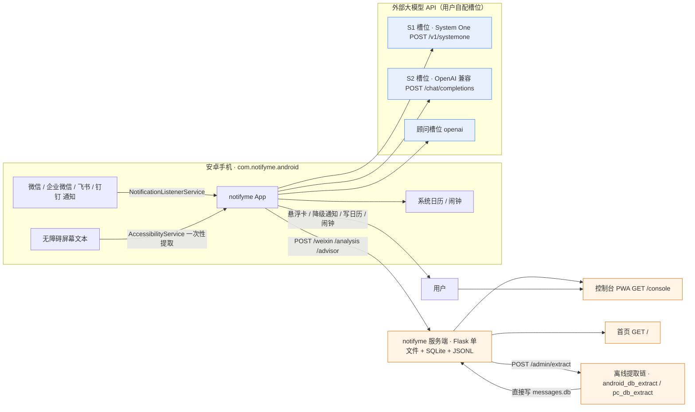
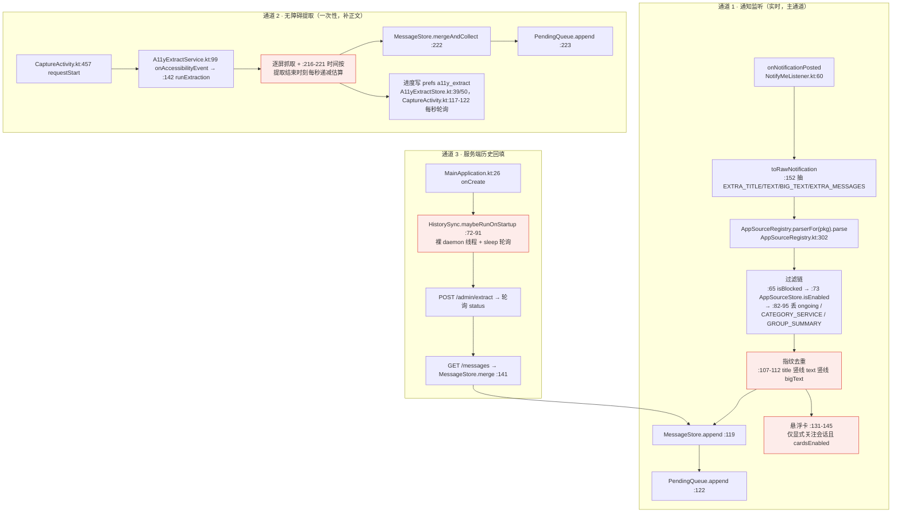
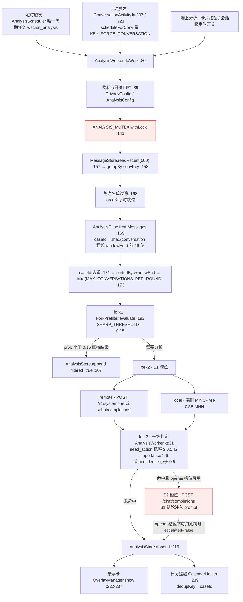
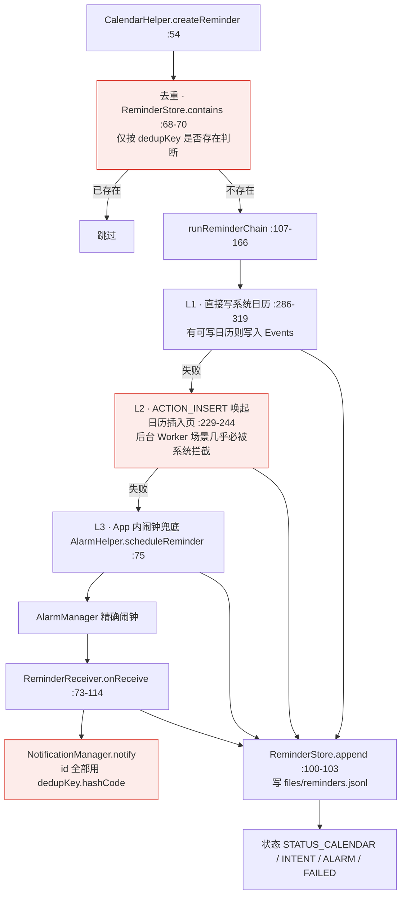
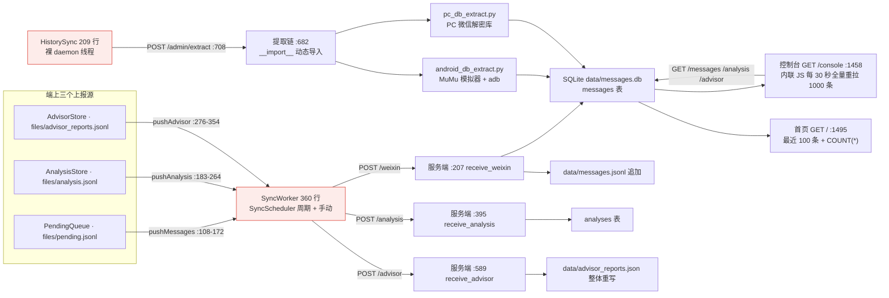
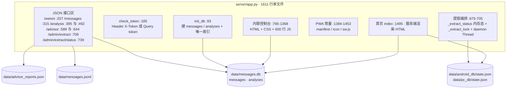
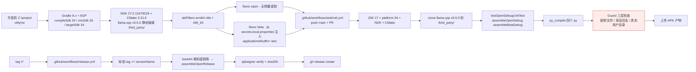
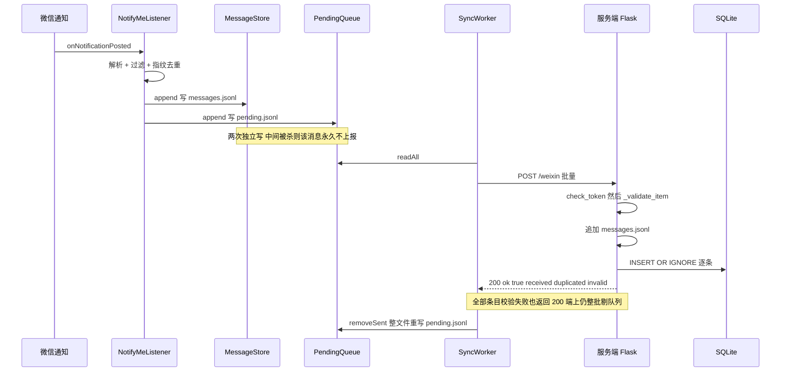

# notifyme 架构图与问题审计

> **范围**：对 C:\project\notifyme 当前工作区做**只读**审计，重新绘制架构图并汇总问题与修改建议。**未修改任何源码或配置**。
> **基线**：commit 62c2b4c · 2026-10-07 15:11 · versionName 0.2.0 / versionCode 5
> **规模口径**（实测，非文档转述）：Android 主源 **67** 个 .kt + 单测 **12** 个（**无** app/src/androidTest）、res/layout **31** 个、app/src/main/cpp/llama_jni.cpp 176 行、server/app.py **1611** 行、server 侧另有 android_db_extract.py / pc_db_extract.py / gen_icons.py。
> **与 docs/architecture/README.md 的关系**：该文档自述「图 04–09 仍为 M2 前基线（0.1.3 / 41 个 Kotlin 文件 / server/app.py 1491 行）」；本文档按**当前代码**重新绘制，差异见 §7。
> **证据约定**：每个问题都给出 文件:行号；不确定的结论显式标注「存疑」。
> **图**：均为 Mermaid，可直接在 GitHub/支持 Mermaid 的编辑器渲染；源文件见本文件内嵌代码块。

---

## 目录

0. [摘要](#0-摘要)
1. [系统上下文](#1-系统上下文)
2. [Android 端分层](#2-android-端分层)
3. [三条采集通道](#3-三条采集通道)
4. [分析决策流水线](#4-分析决策流水线)
5. [提醒三级降级链](#5-提醒三级降级链)
6. [同步、端上存储与服务端](#6-同步端上存储与服务端)
7. [与既有架构文档的差异](#7-与既有架构文档的差异)
8. [问题清单](#8-问题清单)
9. [修改建议与路线图](#9-修改建议与路线图)
10. [附录：实测数据与复现命令](#10-附录实测数据与复现命令)

---

## 0. 摘要

**做得好的地方**

- 骨架清晰且有明确的工程自律：仅 4 个第三方依赖（core-ktx / recyclerview / work-runtime-ktx / okhttp），零协程框架外依赖；受限于 Android 侧无协程基建，采集与存储大量使用「Core 类 + 纯 JVM 单测」的做法（MessageStoreCore、PendingQueueCore），12 个单测全部是可在 JVM 上跑的纯逻辑测试。
- 关键路径有降级设计：分析有 fork1 预筛 → S1 → S2 三级，提醒有「插系统日历 → ACTION_INSERT → App 内闹钟」三级兜底，端侧模型不可用时 UnavailableLocalLlmEngine 兜底。
- 代码卫生良好：全仓 *.kt 无 GlobalScope / runBlocking / 裸 Thread(，也无 TODO/FIXME/HACK。
- CI 有 Guard 步骤（密钥文件、竞品包名、真实用户目录路径），说明作者已有防泄漏意识——只是这条 Guard 现在**必然失败**（见 §8 P0-2）。

**必须先修的四类结构性问题**

1. **隐私与合规已经破防**：公开仓库里有**真实微信截图**（card_real.png、s1.png，可读出真实群名与消息正文），且 docs/ROADMAP.md:75、progress.md:334 写着真实用户名与密钥库路径（C:\Users\smith\notifyme-release\notifyme-release.jks），后者让 CI 的 Guard 步骤**必然红灯**（本地已逐字复现）。
2. **网络与服务端几乎不设防**：AndroidManifest.xml:44 全局 usesCleartextTraffic=true，上报走明文 HTTP；server/app.py 未设 WEIXIN_TOKEN 时**全部接口无鉴权**却默认 bind 0.0.0.0。
3. **存储层非原子**：5 个 JSONL 各有自己的 readLines → writeText 全量重写，重写中途被杀会丢掉全量历史；SharedPreferences 16 个无统一入口，加锁口径不一致。
4. **多处静默失败**：服务端 /weixin 即使全部条目校验失败也返回 200 ok:true 而端上只看 isSuccessful 就剔队列（消息永久丢）；周期 Worker 返回 Result.failure() 会被 WorkManager 取消（401 之后同步永久停摆）；LOCAL_ONLY 隐私模式下顾问链路仍把原文发往云端。

**问题统计**：P0 **18** 项、P1 **78** 项、P2 **44** 项、架构债 **11** 项（逐条见 §8，均带文件:行号证据与修复建议）。

**一句话结论**：这是一份完成度不错、但**隐私边界与存储原子性尚未收口**的个人项目；建议按 §9 的「阶段 0 止血 → 阶段 1 可靠性 → 阶段 2 架构 → 阶段 3 工程化」推进，阶段 0 的工作量约 1 天。

---

## 1. 系统上下文



关键事实：

- 端上**没有自建账号体系**，所有云端能力都靠用户自己填的 API 槽位（app/src/main/java/com/notifyme/android/AnalysisConfig.kt:72-90）。S2 预置了两个可选服务：S2_JEV_URL=https://api.typesafe.ai/v1、S2_GLM_URL=https://open.bigmodel.cn/api/coding/paas/v4（S2_GLM_MODEL=glm-5.3-flash）。
- 自建服务端是**单文件 Flask**（server/app.py 1611 行），既是 API 也是控制台（600 行内联 HTML/CSS/JS 在 server/app.py:765-1368），同时还是离线提取链的入口（server/app.py:708）。
- 三条数据来源并存：通知监听（实时）、无障碍提取（补历史/补正文）、离线数据库提取（PC 或模拟器上跑，见 server/android_db_extract.py:479、server/pc_db_extract.py:328）。

---

## 2. Android 端分层

```mermaid
graph TD
  subgraph ui["UI 层 · 18 个 Activity"]
    MA["MainActivity 1060 行<br/>含 FeedAdapter / ItemTouchHelper / CollapseStore"]
    CA["ConversationActivity 580"]
    CAP["CaptureActivity 554 + CaptureDiagnosticsActivity 260"]
    AS["AnalysisSettingsActivity 593 + AnalysisListActivity 194"]
    RS["ReminderSettingsActivity 117 + ReminderListActivity 193"]
    OT["ConsoleActivity 133 / ModelListActivity 218 / SourcesActivity 195<br/>WatchlistActivity 169 / PrivacySettingsActivity 127<br/>OverlaySettingsActivity 103 / OnboardingActivity 142<br/>PromptEditActivity 80 / RedactorPreviewActivity 123 / EngineSmokeActivity 74"]
  end

  subgraph capture["采集常驻层"]
    NL["NotifyMeListener 240<br/>NotificationListenerService"]
    AE["A11yExtractService 580<br/>AccessibilityService"]
    OV["OverlayService 367<br/>前台服务 + 悬浮卡"]
    KA["KeepAliveService 145<br/>看门狗 + requestRebind"]
    BR["BootReceiver 34 / ReminderReceiver 116 / OverlayActionReceiver 36"]
  end

  subgraph job["后台任务层 · WorkManager"]
    SW["SyncWorker 360"]
    AW["AnalysisWorker 800"]
    ADVW["AdvisorWorker 247"]
    MW["ModelDownloadWorker 248"]
    SCH["SyncScheduler 60 / AnalysisScheduler 126 / AdvisorScheduler 54"]
    HS["HistorySync 209<br/>裸 daemon 线程 + sleep 轮询"]
  end

  subgraph domain["领域决策层"]
    AC["AnalysisCase 323"]
    FP["ForkPrefilter 135"]
    AP["AnalysisParsing 143"]
    CH["CalendarHelper 417 / AlarmHelper 95"]
    MR["MessageReplier 78 / RedactorCore 284"]
  end

  subgraph store["存储层"]
    JS["JsonlStore 92"]
    MS["MessageStore 453"]
    PQ["PendingQueue 218"]
    AS2["AnalysisStore 355 / AdvisorStore 187 / ReminderStore 164"]
    PREF["16 个 SharedPreferences"]
  end

  subgraph native["端侧推理"]
    LE["LocalLlmEngine 119 / LlamaCppEngine 55 / LlamaJni 38"]
    CPP["llama_jni.cpp 176 · llama.cpp v0.5.0 静态链接"]
  end

  NL --> MS
  NL --> PQ
  NL -.->|"反向依赖 UI 层"| OV
  AE --> MS
  AE --> PQ
  AW --> FP
  AW --> AC
  AW --> AP
  AW --> AS2
  AW -.->|"直接调 UI/系统"| OV
  AW --> CH
  ADVW --> AS2
  SW --> PQ
  SW --> AS2
  SW --> MS
  MS --> JS
  PQ --> JS
  AS2 --> JS
  PREF --- AS2
  PREF --- MS
  LE --> CPP
  AW --> LE
  HS --> MS
  KA --> NL
  OV --> MA
```



结构性观察（细节见 §8）：

- **单扁平包**：67 个主源文件全部在 com.notifyme.android 一个包下，没有 capture/ storage/ analysis/ ui/ 之类子包，分层只体现在类名与注释上。
- **上帝类集中**：MainActivity 1060 行、AnalysisWorker 800 行、A11yExtractService 580 行、AnalysisSettingsActivity 593 行、CalendarHelper 417 行（含自然语言时间解析）——这几个文件承载了全项目约 1/3 的代码。
- **反向依赖**：采集常驻层（NotifyMeListener.kt:131-145）与后台任务层（AnalysisWorker.kt:222-237）直接调用 UI 层的 OverlayManager / OverlayService；CalendarHelper.kt:229-244 在 Worker 里用 context.startActivity 拉起日历 Activity。
- **UI 无状态管理框架**：全仓无 ViewModel / StateFlow / LiveData（除 WorkManager 自带的 getWorkInfosByTagLiveData），界面刷新靠手工 refreshMessages + Handler(Looper.getMainLooper()) 轮询（CaptureActivity.kt:115、ConversationActivity.kt:89、ModelListActivity.kt:28、OverlayService.kt:55）。

---

## 3. 三条采集通道



红色节点是已知有缺陷处：N5 指纹未含 MessagingStyle 明细（连续同文消息会被当刷新丢弃）、N8 无 try/catch 的后台 startForegroundService（Android 12+ 崩溃）、A3 时间戳是估算值、H2 绕过 WorkManager 且先写冷却时间戳。

数据落盘结构（端上）：

| 文件 | 写入者 | 读取者 | 特点 |
|---|---|---|---|
| files/messages.jsonl | MessageStore.kt:96（append）/ merge | 全部 UI、AnalysisWorker、SyncWorker | 只追加，无轮转，无上限 |
| files/pending.jsonl | PendingQueue.kt:49 | SyncWorker | 上报成功后整文件重写 |
| files/analysis.jsonl | AnalysisStore.kt:226 | AnalysisWorker、SyncWorker、ConversationActivity | 重写非原子 |
| files/reminders.jsonl | ReminderStore.kt:94 | MainActivity（日历角标） | 重写非原子 |
| files/advisor_reports.jsonl | AdvisorStore.kt:96 | SyncWorker | 裁剪重写非原子 |
| files/models/{modelId}/ | ModelDownloadWorker | LlamaCppEngine | 仅比对字节数，无哈希校验 |

---

## 4. 分析决策流水线



关键算法常量（实测）：

| 项 | 值 | 位置 |
|---|---|---|
| 预筛阈值 SHARP_THRESHOLD | 0.15（prob 小于 0.15 判定无需分析） | ForkPrefilter.kt:23 |
| 乘性惩罚 | 窗口小于 2 条 ×0.3；junkRatio ≥ 0.8 ×0.05、≥ 0.5 ×0.3；无字母数字则 prob=min(prob,0.02) | ForkPrefilter.kt:59 |
| 升级概率 | escalateProb = max(needActionProb, importance/9) | AnalysisWorker.kt:381 |
| importance 还原 | 0-1 区间则 ×9 还原到 0-9 档 | AnalysisWorker.kt:603 |
| confidence | 取各题最小值 | AnalysisWorker.kt:612-622 |
| 每轮会话上限 | take(MAX_CONVERSATIONS_PER_ROUND)，读取窗口 500 条 | AnalysisWorker.kt:173 / :157 |
| caseId | sha1(conversation + windowEnd) 前 16 位 | AnalysisCase.kt |

---

## 5. 提醒三级降级链



---

## 6. 同步、端上存储与服务端

### 6.1 上报与拉取



### 6.2 服务端单文件架构



数据模型与接口（实测）：

| 表 | 关键列 | 索引 |
|---|---|---|
| messages | id, pkg, conversation, sender, timestamp, text, source, received_at | 唯一索引 (conversation, sender, timestamp, text)，前缀含 pkg（server/app.py:131-137） |
| analyses | case_id 唯一, conv_key, analyzed_at, importance, forks, redacted 等 | case_id UNIQUE（server/app.py:451-480） |

| 端点 | 方法 | 鉴权 | 说明 |
|---|---|---|---|
| /weixin | POST | 是 | 批量上报，返回 received / duplicated / invalid（server/app.py:284-289） |
| /messages | GET | 是 | 支持 pkg / conversation / date 过滤，固定 limit 1000 |
| /analysis | POST / GET | 是 | 分析结果上报与查询 |
| /advisor | POST / GET | 是 | 顾问报告，JSON 文件整体重写 |
| /admin/extract | POST | 是 | 触发离线提取（source=android/pc/all，running 时 409） |
| /admin/extract/status | GET | 是 | 读内存态进度 |
| / | GET | 是 | 首页，最近 100 条 + 总数 |
| /console | GET | 是 | 控制台 PWA 单页 |
| /console/manifest.json | GET | **否** | PWA 资源（server/app.py:1469） |
| /console/icon | GET | **否** | PWA 资源（server/app.py:1475） |
| /sw.js | GET | **否** | Service Worker（server/app.py:1483） |

### 6.3 构建与发布



### 6.4 一次上报的时序



---

## 7. 与既有架构文档的差异

docs/architecture/README.md 自述「图 04–09 仍为 M2 前基线」，实测差异如下（左为文档说法，右为当前代码）：

| 项 | 文档说法 | 实测 |
|---|---|---|
| 版本基线 | 0.1.3 | 0.2.0 / versionCode 5（app/build.gradle.kts） |
| Kotlin 文件数 | 41 | **67** 个主源（另 12 个单测，无 androidTest） |
| server/app.py | 1491 行 | **1611** 行 |
| UI 层 Activity | 「10 个 Activity」 | **18** 个（AndroidManifest.xml:46-72） |
| SharedPreferences | 12 个 | **16** 个（缺 app_sources / conv_analysis_schedule / privacy_config / overlay_config） |
| ConsoleActivity | 「八张卡片」并给出行号 L727 / L826 | 实际 5 张入口卡 + 保活卡，activity_console.xml 仅 249 行 |
| check_token 行号 | 152 | 185 |
| init_db 行号 | 74 | 93 |
| receive_weixin 行号 | 174 | 207 |
| GET /messages 行号 | 277 | 315 |
| receive_analysis 行号 | 349 | 395 |
| GET /console 行号 | 1345 | 1458 |
| collapse_state 位置 | MainActivity.kt:997 | 1009 |
| 版本与名称 | 「0.1.3」「微信分析助手」 | 0.2.0 / notifyme（docs/BUILD.md:53 同样过时） |
| 悬浮通知 | README.md:158 称「M9 规划中」 | 已实现（OverlayService 为 specialUse 前台服务） |
| 端侧引擎 | strings.xml:304 称「尚未编译进 App」，README.md:35 称「支持端侧 Agent 推理」 | JNI + CMake + Gradle 均已接上（app/src/main/cpp/llama_jni.cpp、LlamaJni.kt:16）——两者矛盾，**存疑**，需真机验证 |
| 构建前置 | docs/BUILD.md:8-23 缺 NDK 27.2.12479018 与 CMake 3.31.6，且无「clone llama.cpp v0.5.0 到 third_party/」步骤 | app/src/main/cpp/CMakeLists.txt:19,38 无条件 add_subdirectory(third_party/llama.cpp)，而 third_party/ 被 .gitignore 忽略 → **照文档新克隆的仓库必然构建失败** |

结论：docs/architecture 的图 01–03 仍可用，04–09 与所有行号引用都需要按本文档重建；更根本的修法是「图源 .mmd 保留 + 行号与清单由脚本生成」，否则下一次重构会再次漂移。

---

## 8. 问题清单

> 严重度定义：**P0** = 数据正确性 / 隐私 / 崩溃级别，应在下次提交前修；**P1** = 明确的缺陷或高风险；**P2** = 体验、可维护性与防御性问题；**架构债** = 不单独构成缺陷但持续抬高修改成本。
> 统计：P0 **18** 项、P1 **78** 项、P2 **44** 项（均带文件:行号证据与修复建议），另有架构债 **11** 项。

### 8.1 P0（必须优先修）

**A. 隐私与合规**

**P0-1 公开仓库提交了真实微信使用截图**
- 证据：card_real.png、s1.png（均 1220x2656，已逐张目视核对）、overlay_card.png，均在根目录且被 git 跟踪。
- 事实：card_real.png 含真实群名「微信 · "小柿子"合唱团·班级群」、消息原文「陈老师：@所有人 明天（周四）正常训练哦！训练时间：16:30-17:30 训练地点：明德校区体育馆…」、真实会话「中国工商银行 喜迎金秋，乐享好物」。
- 影响：直接违反 progress.md:436 硬约束「不提交用户真实数据」；仓库为 Public（progress.md:426），泄漏无法撤回。
- 建议：删除并按需替换为合成 / 脱敏截图；用 git filter-repo 清历史后强推（**需用户明确授权**）；CI 增补「根目录图片白名单 + 敏感信息检查」。

**P0-2 真实用户名与密钥库路径入库，导致 CI Guard 必然红灯**
- 证据：docs/ROADMAP.md:75 = C:\Users\smith\notifyme-release\；progress.md:334 = C:\Users\smith\notifyme-release\notifyme-release.jks；.github/workflows/android.yml 的 Guard 步骤 ③。
- 复现（Git Bash 逐字执行 CI 命令）：git grep -In 搜索 C:\Users\ 命中 5 行，其中 3 行是占位符 C:\Users\<你> 会被 grep -v 滤掉，**残留 2 行真实路径 → 管道退出码 0 → 触发 ::error::「发现真实个人用户目录路径」**。
- 影响：main 分支 CI 长期红灯（掩盖真实失败）；真实用户名与密钥库绝对路径已进入公开仓库。
- 建议：两处改为占位符；Guard 改用字面匹配（git grep -InF 配 grep -vF），避免 BRE 中反斜杠加尖括号的词界歧义；并把「存量违规」与「禁止新增」拆成两条检查。

**P0-3 服务端未配置令牌时全接口无鉴权，却默认监听 0.0.0.0**
- 证据：server/app.py:50（TOKEN 默认空）、server/app.py:194-195（空则直接放行）、server/app.py:1607/1611（app.run host=0.0.0.0）、server/启动服务.bat（缺 secrets.local.bat 时只打印一行警告）。
- 影响：同网段任何人可读全量聊天原文、伪造上报、触发提取端点。
- 建议：无 WEIXIN_TOKEN 时默认只 bind 127.0.0.1（或拒绝启动），需显式 --allow-insecure 才放开；启动日志明确标注鉴权状态。

**P0-4 全局允许明文 HTTP，且用户可配置任意 http 端点并携带密钥**
- 证据：app/src/main/AndroidManifest.xml:35-44（usesCleartextTraffic="true"，注释自承生产应移除）、SyncConfig.kt:53-55、SyncWorker.kt:138-141、AnalysisSettingsActivity.kt:406/476。
- 影响：聊天正文、分析结果与 X-Token / Bearer 可被同网段嗅探或中间人改写；令牌还可能经 ?token= 进入反代日志与浏览器历史（server/app.py:198、server/README.md:306）。
- 建议：默认移除该属性，改用 networkSecurityConfig 仅对局域网调试地址放行；服务端令牌改一次性兑换 + HttpOnly Cookie，并加 Referrer-Policy。

**P0-5 顾问链路完全不读隐私模式，LOCAL_ONLY 下仍上传原文**
- 证据：AdvisorWorker.kt:80-125、:131-155；全仓 grep 无 AdvisorWorker 引用 PrivacyConfig（PrivacyConfig.get 仅出现在 AnalysisWorker.kt:89/:344、SyncWorker.kt:73）；AdvisorScheduler.kt:32-40。
- 影响：隐私承诺在顾问路径上失效，真实会话名与 S2 摘要原文会发往云端。
- 建议：在 AdvisorWorker / AdvisorScheduler 入口补 PrivacyConfig 门控并复用 redactCase；把「是否允许上传」收敛为一个横切判定，所有上报通道必须经过它。

**B. UI 线程阻塞与数据破坏**

**P0-6「清空数据」一键删除全部消息与待发队列，无二次确认**
- 证据：MainActivity.kt:203-209 → MessageStore.clear（MessageStore.kt:168）→ core.clear（MessageStore.kt:318）→ JsonlStore.delete（JsonlStore.kt:31）直接删文件。
- 影响：不可恢复的全量数据丢失；同文件对删除单会话 / 单日期反而都有 AlertDialog，前后不一致。
- 建议：加 AlertDialog 二次确认并说明不可恢复，或改为软删除 + 回收站。

**P0-7 诊断页在主线程全量读取并逐行解析整个 messages.jsonl**
- 证据：CaptureDiagnosticsActivity.kt:42 / :47（onCreate 与 onResume 直接调 render）、:107（storageStats 全文件统计）、:123（MessageStore.readRecent(this, 1_000_000)）、:128-149（groupBy / distinct / maxOfOrNull 全量计算）；底层 MessageStore.kt:295-315。
- 影响：消息量上来必然 ANR / OOM。
- 建议：limit 降到合理值并移到后台线程分页聚合；readRecent 改尾读。

**P0-8 首页搜索每敲一个字符都在主线程全量读盘 + JSON 解析 + 排序**
- 证据：MainActivity.kt:151-152（afterTextChanged → refreshMessages）、:462-463（refreshMessages 第一行即 MessageStore.readRecent(this, 500)）、MessageStore.kt:298-313。
- 建议：300ms 防抖 + 内存缓存（或 ViewModel）内过滤，不再每次重读文件。

**P0-9 会话详情页把最多 500 条消息逐条 inflate 并 addView，勾选一条就重建整个对话流**
- 证据：ConversationActivity.kt:275-343（renderChat 内 LayoutInflater.inflate 配 addView）、:399（syncMsgSelection → renderContent）、:246。
- 建议：换 RecyclerView + ListAdapter / DiffUtil，勾选态只 notifyItemChanged，滚动位置交给 LayoutManager。

**P0-10 批量删除会话时在主线程串行读写 6 类存储**
- 证据：MainActivity.kt:336-349（deleteConversationsFully 连续调 ReminderStore / AlarmHelper / CalendarHelper / PendingQueue / AnalysisStore / MessageStore）。
- 建议：整段移到后台线程或 WorkManager，完成后一次性回主线程刷新并给进度提示。

**C. 端上存储与服务端一致性**

**P0-11 悬浮卡路径在后台直接 startForegroundService 且无 try/catch → Android 12+ 抛 ForegroundServiceStartNotAllowedException**
- 证据：NotifyMeListener.kt:131-145 → OverlayManager.kt:59（ContextCompat.startForegroundService，无 try/catch）、AnalysisWorker.kt:226。
- 影响：异常沿 onNotificationPosted 冒泡，监听进程崩溃、消息丢失。
- 建议：OverlayManager 内 try/catch 并降级为普通通知；或改由已在运行的前台服务 / 加急任务二次启动。

**P0-12 通知去重指纹只含 title 竖线 text 竖线 bigText，未含 MessagingStyle 明细**
- 证据：NotifyMeListener.kt:107-112（fingerprint、recentKeys[sbn.key] 比较）；同一 sbn.key 下连续两条同文消息会被当「刷新」丢弃，而 onNotificationRemoved（:218-221）又删该 key，同一事实两套互斥处理（**存疑**：取决于厂商是否复用 key）。
- 建议：指纹纳入 MessagingStyle 末条的 sender + timestamp + 条数。

**P0-13 多个 JSONL 各自用 readLines → writeText 整文件重写，非原子**
- 证据：JsonlStore.kt:65-72（:71 file.writeText 先截断再写）、MessageStore.kt:426-438、PendingQueue.kt:194-208、AnalysisStore.kt:307-329、AdvisorStore.kt:113-120、ReminderStore.kt:124-143。
- 影响：重写中途被杀会丢掉整个文件（含全量历史）；删除会话 / 规范化 / 上报剔除路径都走这里。
- 建议：统一到「临时文件 + fsync + ATOMIC_MOVE」的原子重写，全部收敛到 JsonlStore 一处。

**P0-14 周期 Worker 返回 Result.failure() 会被 WorkManager 取消周期任务**
- 证据：SyncWorker.kt:154-158（401 即 failure）、SyncScheduler.kt:36-45。
- 影响：一次令牌错误之后定时同步永久停摆，且用户无从感知。
- 建议：401 等配置类错误落库为「配置错误」并返回 success（或 retry），不要 fail 周期任务。

**P0-15 /weixin 全部条目校验失败仍返回 200 ok:true，端上只看 isSuccessful 就整批剔队列**
- 证据：server/app.py:284-289（返回体）、SyncWorker.kt:147-150（只判 isSuccessful → PendingQueue.removeSent）。
- 影响：被拒消息永久不补报，端上无从发现。
- 建议：部分失败返回 207 / 422 或回传 acceptedIds，端上只剔被接受的 id。

**D. 端侧推理崩溃风险**

**P0-16 native 侧 batch 固定 512 而只校验 n_ctx，prompt 超 512 token 即越界写 / GGML_ASSERT abort**
- 证据：app/src/main/cpp/llama_jni.cpp:102（batch 初始化）、:143-146（只校验长度对 n_ctx）、:160-165。
- 建议：按 prompt 长度扩容 batch，或直接 llama_batch_init(n_ctx)。

**P0-17 nativeCreate 在 ReleaseStringUTFChars 之后仍用已释放的 model_path 拼错误消息**
- 证据：app/src/main/cpp/llama_jni.cpp:78-80。
- 影响：悬垂指针，错误路径上读已释放内存。
- 建议：先拷成 std::string 再 Release，错误分支同样处理。

**P0-18 LocalLlmEngines.releaseAll 可被 onTrimMemory / onLowMemory 在任意线程调用，与 nativeComplete 无锁竞争**
- 证据：LocalLlmEngine.kt:114-118、MainApplication.kt:46-58、LlamaCppEngine.kt:48-54（close 掉正在使用的 handle）。
- 影响：use-after-free 崩溃。
- 建议：引擎加引用计数 / 读写锁，release 前等待 chat 收尾；handle 加 @Volatile。

### 8.2 P1（明确的缺陷或高风险）

**安全与隐私**

- [P1] 令牌可经 ?token= 传递，必然落入反代访问日志、浏览器历史与 Referer（端上抹地址栏发生在请求之后）—— 证据：server/app.py:198、:909-913、server/README.md:306 ｜ 建议：改一次性兑换码换 HttpOnly Cookie，并加 Referrer-Policy。
- [P1] X-Token 与 query token 都用 == 比较，非常量时间，理论上可被逐字节时序探测 —— 证据：server/app.py:196、:198 ｜ 建议：统一 hmac.compare_digest。
- [P1] 槽位 API Key、Basic 认证口令、监控令牌全部明文存 SharedPreferences（仅 allowBackup=false 缓解）—— 证据：AnalysisConfig.kt:111、:357-363、:387-399、SyncConfig.kt:53-55 ｜ 建议：EncryptedSharedPreferences 或 Keystore 派生密钥。
- [P1] 完整消息正文写入 logcat —— 证据：NotifyMeListener.kt:127、A11yExtractService.kt:201 ｜ 建议：release 只打长度或哈希。
- [P1] 悬浮卡与降级通知直接渲染消息正文，未设 setVisibility(SECRET)，锁屏 / 通知栏泄露 —— 证据：OverlayManager.kt:97-107、OverlayService.kt:110-113 ｜ 建议：加 VISIBILITY_SECRET，并按隐私模式先脱敏。
- [P1] 脱敏人名映射是 sha256(名字) 前 6 位，可枚举比对；字面量替换无词边界会误伤单字姓名 —— 证据：RedactorCore.kt:32-40、:115-130 ｜ 建议：引入随机盐 + 分词 / 词边界匹配。
- [P1] Debug 构建注册导出的广播接收器，任意应用可发广播触发无障碍「开始提取」—— 证据：MainApplication.kt:32-42（RECEIVER_EXPORTED）｜ 建议：校验调用方签名，或改 significance 级自定义权限（能否改 NOT_EXPORTED 存疑，取决于 adb 调试方式）。

**数据可靠性**

- [P1] 客户端上报的 analyzed_at 是毫秒数字，服务端只接受 str，该列永远 NULL，控制台与查询全空 —— 证据：server/app.py:470-471、AnalysisStore.kt:34、:119 ｜ 建议：服务端接受数字，或端上统一改 ISO 字符串。
- [P1] 同因 importance 永远 NULL，重要度 chip、待办排序、todo_only 过滤全部失效 —— 证据：server/app.py:442-443、:1219-1222、:1251-1257、AnalysisStore.kt:41 ｜ 建议：放宽类型判断，或端上统一为 high / mid / low。
- [P1] 脱敏证据 redacted / redaction_rules / redaction_hits 上报后被服务端整列丢弃，与客户端注释意图相反 —— 证据：server/app.py:451-480、AnalysisStore.kt:148-154 ｜ 建议：analyses 补三列并在 README 写明。
- [P1] /weixin 先追加 jsonl 再写库，且只捕 IntegrityError，其它 SQLite 异常冲出循环时 commit 被跳过（finally 只 close），出现 jsonl 有而库无，重试再堆重复 —— 证据：server/app.py:244-245、:258-275、:277、:280-282 ｜ 建议：同一事务内先库后盘，捕 sqlite3.Error 并显式 rollback。
- [P1] 端上入库 messages.jsonl 与入队 pending.jsonl 是两次独立写，中间被杀则消息永久不上报 —— 证据：NotifyMeListener.kt:119-122、A11yExtractService.kt:222-223 ｜ 建议：单事务语义，或启动时补扫未入队消息。
- [P1] readUnsynced 基于 readRecent(500)，超过 500 条的更老未同步分析记录永远不会补报 —— 证据：AnalysisStore.kt:335-340、:268-285 ｜ 建议：直接按文件顺序扫水位之后的行。
- [P1] 提醒去重只查 dedupKey 是否存在，FAILED 记录也算已创建，一次失败后该提醒永不重试 —— 证据：CalendarHelper.kt:68-70、ReminderStore.kt:106-121、CalendarHelper.kt:172-198 ｜ 建议：仅对成功状态去重，FAILED / INTENT 允许重试。
- [P1] 无 POST_NOTIFICATIONS 权限时 ReminderReceiver 直接 return，提醒静默丢失且不落失败状态 —— 证据：ReminderReceiver.kt:73-79 ｜ 建议：落 STATUS_FAILED 并引导授权或改期补发。
- [P1] 降级链 L2 用 context.startActivity 唤起日历插入页，后台 Worker 场景几乎必被拦截却仍按成功记录 —— 证据：CalendarHelper.kt:229-244、:107-166 ｜ 建议：仅在可前台启动时走 L2，否则直接降级 L3 并如实记录。
- [P1] parseDueTime 对「周X」命中当天时恒取下周，产生晚一周的错误提醒时间 —— 证据：CalendarHelper.kt:407-408 ｜ 建议：当天且时刻未过时应取当天。
- [P1] LocalModelStore.delete 不取消正在下载的 Worker，文件被删后 Worker 仍继续写并回写状态 —— 证据：LocalModelStore.kt:143-150、ModelDownloadWorker.kt:64-76 ｜ 建议：delete 前 cancel 唯一任务并等待结束。
- [P1] 去重键把 conversation 与 sender 直接拼接（无分隔符）会撞键误丢消息；a11y 去重键刻意不含时间戳；三份实现口径不一 —— 证据：MessageStore.kt:445-452、:228、A11yExtractService.kt:321 ｜ 建议：加显式分隔符、抽统一工具、a11y 用「提取批次 + 屏序」限定范围。
- [P1] 「规范化」用已知字段重建 JSON 会静默丢未知字段；PendingQueue 重写按对象重新序列化会静默丢损坏行且无计数 —— 证据：MessageStore.kt:345-367（:361）、PendingQueue.kt:118-121、:151-154、:194-208 ｜ 建议：只补缺失字段，并记录丢弃条数暴露到诊断页。
- [P1] a11y 消息时间全部锚定「提取结束时刻」每秒递减；群 / 私聊标记取自本地已有记录，首次提取的群聊会全标成私聊 —— 证据：A11yExtractService.kt:216-221、:159-162 ｜ 建议：优先解析屏上时间分隔行；群聊标记从界面线索判定或标 unknown。
- [P1] 提取状态是进程内存态且仅在末尾复位，多 worker 下 409 互斥失效，线程卡死即永久 409，无心跳与超时 —— 证据：server/app.py:675-679、:703-705、:729-730 ｜ 建议：状态落盘带时间戳过期 + finally 复位 + 心跳。
- [P1] 解密出的明文聊天库只在流程成功后删除，合并中途抛错就长期留在 data/android_db/ —— 证据：server/android_db_extract.py:504-508、server/app.py:699-700 ｜ 建议：finally 清理 + 启动时清扫残留明文。
- [P1] MessageReplier 只捕 PendingIntent.CanceledException，其它 RuntimeException 逃逸 —— 证据：MessageReplier.kt:53-77 ｜ 建议：catch Exception 并返回明确失败结果。
- [P1] messages.jsonl 只追加、无轮转 / 配额 / 清理，pending.jsonl 在服务端长期不可达时同样无上限 —— 证据：MessageStore.kt:263-266、:38-39、PendingQueue.kt:131-134 ｜ 建议：按大小 / 时间滚动归档，队列设上限并计数。

**性能与内存**

- [P1] 读取路径全量载入：readRecent 每次 readLines 整文件，merge 还把全文件去重键放进 HashSet，历史变大即 OOM —— 证据：MessageStore.kt:295-315、:398-405、JsonlStore.kt:45-48 ｜ 建议：尾部按行倒读 + 限制合并扫描窗口。
- [P1] 采集回调线程同步做磁盘写、prefs 全量重写与 PackageManager IPC，阻塞会漏通知 / ANR（注释自称 binder 线程，实际由主 Looper 派发——存疑）—— 证据：NotifyMeListener.kt:119-126、:209-216、AppSourceStore.kt:129、OverlayConfig.kt:41、CaptureStats.kt:16 ｜ 建议：回调只做内存入队，落盘交给单线程 worker。
- [P1] 每条入库消息都全量重写 prefs 的 observed JSON 数组（O(n) 序列化 + apply）—— 证据：AppSourceStore.kt:113-131、:204-214、:90-92 ｜ 建议：仅在包首次出现或标签变化时落盘。
- [P1] messages.timestamp 与 analyses.received_at 均无索引，唯一索引前缀是 pkg 帮不上排序，列表全表扫描 + 临时排序；首页每次还跑一次无索引 COUNT(*) —— 证据：server/app.py:366、:531、:131-137、:1511-1512 ｜ 建议：建 messages(timestamp)、analyses(received_at)、messages(source) 索引。
- [P1] 查看端无分页：固定拉 1000 条消息与 1000 条分析且每 30 秒全量重拉，超过 1000 条的旧消息彻底不可见 —— 证据：server/app.py:1010-1012、:1361、:333 ｜ 建议：增加 cursor 或时间窗分页参数。
- [P1] 两条提取链路都把主库全表载入内存构造去重集合，无 LIMIT 无分批 —— 证据：server/android_db_extract.py:423-425、server/pc_db_extract.py:353-355 ｜ 建议：SQL 侧比对或分批窗口。
- [P1] 网络请求全部阻塞 execute()、无 callTimeout（read 最长 180s），2.4GB 模型加载也在调用线程同步执行，全部占用 Worker 默认线程 —— 证据：AnalysisWorker.kt:66-69、:568、AdvisorWorker.kt:56-61、LlamaCppEngine.kt:29-32 ｜ 建议：切 Dispatchers.IO，补 callTimeout 并响应 isStopped。
- [P1] 单轮内按会话串行分析且每例 delay(500)，无时间预算与 isStopped 检查，长列表易撞 WorkManager 10 分钟上限被取消 —— 证据：AnalysisWorker.kt:141-143、:272、:189-208 ｜ 建议：加轮次预算并在循环中检查取消信号。
- [P1] 持 ANALYSIS_MUTEX 期间再次发起网络请求做 advisor 诊断，长时间占住全局锁 —— 证据：AnalysisWorker.kt:779-799 ｜ 建议：把诊断请求移出锁区间。
- [P1] S2 升级失败被 catch(Exception) 静默吞掉，只记 Log.w，与主循环「网络失败 → retry」语义不一致 —— 证据：AnalysisWorker.kt:412-415、:430-433 ｜ 建议：记录降级原因并纳入重试与状态呈现。
- [P1] 每次 nativeComplete 都 llama_memory_clear 后全量 re-prefill，长窗口下每轮重复计算 —— 证据：app/src/main/cpp/llama_jni.cpp:157 ｜ 建议：保留可复用前缀 KV，或至少评估复用收益。
- [P1] 首页 RecyclerView 被塞进 ScrollView 且 FullHeightRecyclerView 强制全高，回收机制失效、500 条全量 inflate / bind —— 证据：app/src/main/res/layout/activity_main.xml:97-154、FullHeightRecyclerView.kt:25 ｜ 建议：去掉外层 ScrollView，改单 RecyclerView + 多 item type。
- [P1] onBindViewHolder 内逐个 item 读 SharedPreferences，滚动即磁盘 IO —— 证据：MainActivity.kt:807、:817、WatchlistActivity.kt:155 ｜ 建议：提交前把 watched / hasPrompt 映射成 Map 传进 Adapter。
- [P1] 每次列表刷新都新建 4 个 SimpleDateFormat（搜索每敲一键都会触发）—— 证据：MainActivity.kt:472-475；（:685 的 timeFormat 是否仅主线程使用存疑）｜ 建议：提为静态复用或改 DateTimeFormatter。
- [P1] 来源页在主线程枚举设备上所有可启动应用 —— 证据：SourcesActivity.kt:88 ｜ 建议：后台线程 + 缓存预热。
- [P1] 会话详情页每 4 秒在主线程读一次 analysis 存储做轮询 —— 证据：ConversationActivity.kt:106-118（:108 AnalysisStore.latestByConvKey）｜ 建议：改为观察 WorkInfo 完成事件。
- [P1] 多个页面一进入就在主线程全量读存储（未分页、未复用缓存）—— 证据：WatchlistActivity.kt:49（readRecent 1000）、PrivacySettingsActivity.kt:97、RedactorPreviewActivity.kt:49、AnalysisListActivity.kt:92、AnalysisSettingsActivity.kt:512、ReminderListActivity.kt:80 ｜ 建议：统一「后台加载 + 主线程交付」的加载器或 ViewModel。

**并发与线程**

- [P1] SimpleDateFormat 静态实例被多线程共用（dayKeyOf 被 UI / Worker / prefs 剔除路径调用），非线程安全 —— 证据：MessageStore.kt:101、:140-141、PendingQueue.kt:170 ｜ 建议：改 java.time 或 ThreadLocal。
- [P1] storageStats 未加 @Synchronized，与追加写并发读可能读到半行 —— 证据：MessageStore.kt:185-193 ｜ 建议：补同步。
- [P1] KeepAliveService 每次 onStartCommand 都 postDelayed 新看门狗链，多次启动后重复巡检与重复 requestRebind —— 证据：KeepAliveService.kt:114-133（:131）、:96-99 ｜ 建议：post 前先 removeCallbacks。
- [P1] 全仓无 WAL 也无 busy_timeout，写互斥只是进程内 threading.Lock，而文档建议上 waitress / gunicorn 多进程 —— 证据：server/app.py:77、:131、server/pc_db_extract.py:348、server/README.md:345 ｜ 建议：开 WAL 与 busy_timeout，或改为单写进程。
- [P1] 无障碍提取进行中再次 requestStart 只置位而 running 期间不消费，迟到窗口事件会凭空发起提取 —— 证据：A11yExtractService.kt:100-113、:74-78 ｜ 建议：事件入口消费标记，或 running 时直接拒绝。
- [P1] 6 处 runOnUiThread 在 Activity 可能已销毁时直接改视图，全仓无 isFinishing / isDestroyed 守卫，发起线程还隐式持有 Activity —— 证据：CaptureActivity.kt:316、:318、:385-401、:401、:417-430、:430、AnalysisSettingsActivity.kt:396、:434、:457、:493 ｜ 建议：引入 lifecycleScope / ViewModel，至少每块首行做存活判断。
- [P1] 会话详情页 observeForever 注册 WorkManager LiveData 却从不反注册，每次进页再加一个，永久持有 Activity 与整棵视图树 —— 证据：ConversationActivity.kt:174-181（对照 CaptureActivity.kt:230-240 注释自认「非 LifecycleOwner 的权宜」）｜ 建议：保存 observer 在 onDestroy 移除，或改用 getWorkInfosByTagFlow。
- [P1] 「立即提取」的轮询线程会睡满 60 秒（30 × 2s）且无法取消，退出页面后仍在跑网络并回写已销毁视图 —— 证据：CaptureActivity.kt:416-441、触发点 :327、:409 ｜ 建议：改用 WorkManager 或可取消协程。

**UI 正确性与体验**

- [P1] 全部 Activity 无 onSaveInstanceState / ViewModel / SavedStateHandle，manifest 也无 configChanges，旋转或进程重建后状态归零 —— 证据：OnboardingActivity.kt:47、MainActivity.kt:73、:109、:110、ConversationActivity.kt:92、:97、AndroidManifest.xml:46-72 ｜ 建议：关键页引入 ViewModel，轻量状态用 onSaveInstanceState。
- [P1] 无 DiffUtil / ListAdapter（全仓 DiffUtil 命中 0），4 个列表统一 clear + addAll + notifyDataSetChanged —— 证据：MainActivity.kt:697（submit :694-698）、AnalysisListActivity.kt:110、SourcesActivity.kt:167、WatchlistActivity.kt:132 ｜ 建议：统一 ListAdapter + DiffUtil.ItemCallback。
- [P1] 提醒列表每次 reload 直接 new 一个 Adapter 赋给 RecyclerView，滚动位置与复用池全丢 —— 证据：ReminderListActivity.kt:83 ｜ 建议：onCreate 建一次，reload 只更新数据。
- [P1] 无任何本地化与深色模式：主题写死 Theme.Material.Light.NoActionBar，res 下无 values-night / values-en —— 证据：AndroidManifest.xml:43、app/src/main/res/values/ ｜ 建议：抽 themes.xml，补 values-night 与 values-en。
- [P1] 全工程没有 styles / themes 资源，31 个布局全靠内联属性，重复块成灾 —— 证据：activity_analysis_settings.xml:54-56 与 :450-452 逐字相同（全文 507 行内 38 处 textSize）、activity_capture.xml:84-88、:248-252、:407-411 ｜ 建议：抽 style 资源统一。
- [P1] 可访问性近乎为零：31 个布局只有 1 处 contentDescription，折叠 / 展开是可点击 TextView，无角色且触控区不足 48dp —— 证据：activity_main.xml:29-45、:52、MainActivity.kt:157、:163 ｜ 建议：换 Button / ImageButton + contentDescription + 48dp 触控区。
- [P1] 面向用户的字符串硬编码在代码里，strings.xml 中不存在这些字面量 —— 证据：AnalysisSettingsActivity.kt:424、:425、:427、:432、:482、:485-486、:580-587、CaptureActivity.kt:358、:360、:362、:365、ReminderListActivity.kt:102、:118、:166、:168、RedactorPreviewActivity.kt:51、:84-86、MainActivity.kt:753、:872、:886 ｜ 建议：全部迁入 strings.xml。
- [P1] tintStatus 两份逐字复制，且用中文子串「失败 / 鉴权 / 成功 / 完成」判状态色，切语言即失效 —— 证据：AnalysisSettingsActivity.kt:528-538、CaptureActivity.kt:543-553 ｜ 建议：改为结构化结果 + 抽公共函数。
- [P1] WorkManager 进度观察逻辑双份实现，其中一份手写清理、一份泄漏 —— 证据：MainActivity.kt:849-866、:924-957、ConversationActivity.kt:176 ｜ 建议：收口为可复用的单一观察器。

**构建、CI 与文档**

- [P1] release 未开 R8（isMinifyEnabled=false），无收缩无混淆，proguard-rules.pro 实际不生效 —— 证据：app/build.gradle.kts:144、app/proguard-rules.pro ｜ 建议：开启 minify + shrinkResources 并维护规则（保留 JSON 模型与 JNI 类）。
- [P1] 缺签名只 logger.warn，可静默产出未签名发布包，CI 也没有断言 —— 证据：app/build.gradle.kts:149-167 ｜ 建议：CI 中校验产物确实已签名。
- [P1] CI 只跑单测与两个 debug 包，无 lint、无 assembleRelease，发布签名链路只在打 tag 时被验证（release.yml 也不跑单测）—— 证据：.github/workflows/android.yml、.github/workflows/release.yml ｜ 建议：增加 lint 与 release 构建冒烟、beta flavor 单测。
- [P1] Activity / UI 层零自动化测试：无 androidTest 目录，12 个测试文件全是纯 JVM 逻辑测试 —— 证据：app/src/test/java/com/notifyme/android/、.github/workflows/android.yml ｜ 建议：补 Espresso 冒烟（列表 / 清空 / 删除确认）。
- [P1] server 无任何测试；requirements.txt 只有 flask，按 README 装完即 ImportError（安卓提取要 pycryptodome、gen_icons 要 Pillow）；且没有生产 WSGI 服务器 —— 证据：server/requirements.txt:1、server/android_db_extract.py:44、server/gen_icons.py:15、server/app.py:1611 ｜ 建议：补齐依赖、加 pytest、部署换 waitress / gunicorn。
- [P1] docs/architecture 基线过时、行号全表漂移、prefs 清单缺 4 项、Activity 数与 ConsoleActivity 卡片数均不符（详见 §7）—— 证据：docs/architecture/README.md:9、:53、:79、:158-169、:179、:195-226、:259-260 ｜ 建议：标注基线 commit 并由脚本生成清单与行号。
- [P1] server/README.md 接口与数据文件章节与实现不符（icons 端点未鉴权未写、GET /messages 参数表缺 pkg、/analysis 字段表缺 pkg / forks / filtered / redacted、/admin/extract 缺 source、通篇没有 /advisor 与 PC 提取、数据文件表漏 advisor_reports.json 与 pc_db/state.json）—— 证据：server/README.md:100、:144-151、:183-193、:207-215、:332-341 ｜ 建议：按代码重写。
- [P1] docs/BUILD.md 缺 NDK 27.2.12479018 与 CMake 3.31.6 要求，也没有「clone llama.cpp v0.5.0 到 third_party/」步骤，而 CMakeLists 无条件 add_subdirectory，third_party/ 又被 gitignore → 照文档新克隆的仓库构建必失败 —— 证据：docs/BUILD.md:8-23、app/src/main/cpp/CMakeLists.txt:19、:38、.gitignore ｜ 建议：补齐前置条件，或给 CMake 加存在性守卫与清晰报错。
- [P1] README 称「悬浮通知 M9 规划中」但功能已实现；strings.xml 称端侧引擎「尚未编译进 App」而 README 称支持端侧推理 —— 证据：README.md:158、README.md:35、app/src/main/res/values/strings.xml:304 ｜ 建议：实测后统一口径并更新路线图状态。
- [P1] 版本号与对外名称过时：「0.1.3」「微信分析助手」与实际 0.2.0 / notifyme 不符 —— 证据：docs/architecture/README.md:259-260、docs/BUILD.md:53、app/build.gradle.kts:74、:119、strings.xml:3 ｜ 建议：统一全部对外名称。

### 8.3 P2（体验、可维护性与防御性）

**安全与隐私**

- [P2] 银行卡正则 \d{13,19} 会误伤订单号 / 长数字串 —— 证据：RedactorCore.kt:136-196 ｜ 建议：收紧前后缀并加 Luhn 校验。
- [P2] 令牌经 URL 传递却无 CSRF 与来源校验，跨站 img 或链接触发带 token 的 GET 可被利用（存疑：需受害者浏览器内保存过 token）—— 证据：server/app.py:196、:198 ｜ 建议：敏感接口只认请求头，写接口校验来源。
- [P2] 鉴权失败返回 401 但不带 WWW-Authenticate；/console 失败回 JSON 而非登录页，内联 showAuth 分支在首屏永远走不到 —— 证据：server/app.py:200、:1461-1463、:917-921 ｜ 建议：页面路由返回带登录态的 401 页与标准响应头。
- [P2] 未设请求体上限，POST /weixin 直接解析任意大小数组 —— 证据：server/app.py:42、:221 ｜ 建议：设 MAX_CONTENT_LENGTH。
- [P2] 异常吞掉上下文：提取失败只留 str(e) 并经状态接口回给调用方，泄露本地路径与命令输出 —— 证据：server/app.py:699-700、:703-704、:746-750 ｜ 建议：记日志，对外只给错误码与简短原因。
- [P2] 多处 json.load(open(...)) 不关文件句柄，靠 GC 兜底 —— 证据：server/app.py:1521、server/android_db_extract.py:167、server/android_db_extract.py:396、server/pc_db_extract.py:195 ｜ 建议：改 with open 或 read_text。
- [P2] 密钥与路径硬编码：兜底 IMEI、MuMu 安装路径、PC 解密工具链目录经环境变量直接 sys.path.insert，任意目录代码可被导入执行（存疑）—— 证据：server/android_db_extract.py:69、:52-59、server/pc_db_extract.py:68-72 ｜ 建议：移入配置文件并校验路径。
- [P2] MUMU_INDEX 环境变量未校验即进入模拟器 root shell 的 -c 命令串（本地未开 shell=True，风险低，存疑）—— 证据：server/android_db_extract.py:59、:120、:144 ｜ 建议：显式校验环境变量与参数。

**数据与协议细节**

- [P2] 客户端总是上报 forks 数组，服务端把空数组写成 NULL，查询侧又当 None 返回，无法区分无 fork 与老数据 —— 证据：server/app.py:475-476、:555、AnalysisStore.kt:146 ｜ 建议：区分空数组与字段缺失。
- [P2] 顾问报告 created_at 客户端发毫秒数字、服务端原样存，控制台直接显示裸数字，README 却写成 ISO —— 证据：server/app.py:633、:1333、AdvisorStore.kt:28、server/README.md:592-593 ｜ 建议：统一时间表示并在服务端格式化。
- [P2] 安卓增量状态直接覆盖写 state.json，无 tmp + replace，写一半崩溃即游标损坏并回落全量重扫（PC 路已原子）—— 证据：server/android_db_extract.py:463-464、server/pc_db_extract.py:206-209 ｜ 建议：统一 tmp + os.replace。
- [P2] 解析函数可能抛 IndexError / ValueError 而非 ExtractError（varint 越界下标、stat 输出为空后 int()），CLI 只捕 ExtractError 会直接栈回溯 —— 证据：server/android_db_extract.py:196-197、:250、:525-527 ｜ 建议：边界检查并统一包装为 ExtractError。
- [P2] date 过滤用 naive datetime 按本地时区算当日区间，与手机时区不一致时错位（存疑）—— 证据：server/app.py:357-358 ｜ 建议：明确时区或改用 UTC 日界。
- [P2] conversation 走 LIKE %x%，用户可传 % 或 _ 造成全表命中 —— 证据：server/app.py:351-352、:525-526 ｜ 建议：转义 LIKE 通配符或改全文检索。
- [P2] 顾问报告每次 POST 全量重写文件且无条数上限，GET 时全量读入并排序（未取写锁，仅靠 os.replace 原子性）—— 证据：server/app.py:581-586、:662-665 ｜ 建议：改 SQLite 或追加式 JSONL 并限长。
- [P2] S2 任务结构是 who / what / when，控制台兜底用 t.task 或 JSON.stringify，页面显示原始 JSON —— 证据：server/app.py:1236、AnalysisStore.kt:98-112 ｜ 建议：按 who / what / when 渲染。
- [P2] 每条消息单独 open 与 close 一次 jsonl —— 证据：server/app.py:244 ｜ 建议：批量写。
- [P2] deleteEvent 只删 Events 不删 Reminders 行，留下孤儿提醒 —— 证据：CalendarHelper.kt:201-213 ｜ 建议：一并删除对应 Reminders 行。
- [P2] buildStateJson 直接取 messages.last()，无空表保护（存疑：上游 fromMessages 已过滤空表）—— 证据：AnalysisCase.kt:79、:111-123 ｜ 建议：用 lastOrNull 加防御。
- [P2] 诊断页状态点两分支写法相同，状态无区分 —— 证据：CaptureDiagnosticsActivity.kt:180 ｜ 建议：两态用不同字符 / 颜色。
- [P2] 结果文案拼接存在运算符优先级问题：升级数大于 0 时预筛 / 端侧跳过后缀被吞，预筛数大于 0 时 s2LocalSkip 被吞 —— 证据：AnalysisWorker.kt:275-282 ｜ 建议：给各 if 分支加括号后统一拼接。
- [P2] 去重 LRU 仅存进程内存，进程重启后同一条通知可再入一次 —— 证据：NotifyMeListener.kt:54-58、:112 ｜ 建议：落盘水位或明确文档化。
- [P2] a11y 整屏文本兜底会把按钮 / 输入框文案当消息入库 —— 证据：A11yExtractService.kt:466-498 ｜ 建议：限定消息列表容器并排除可点击控件。
- [P2] 悬浮卡数量无上限，autoDismissSeconds ≤ 0 时卡片无限堆叠 —— 证据：OverlayService.kt:63、:126-132、OverlayConfig.kt:14 ｜ 建议：设 MAX_CARDS 并移除最旧。
- [P2] 黑名单只挡自身 / system / systemui，其它系统组件通知仍会入库 —— 证据：AppSourceRegistry.kt:258 ｜ 建议：补常见系统包，或加「仅 IM 类」白名单模式。
- [P2] 无障碍启用判定与诊断页各自解析 Settings.Secure，口径易分叉 —— 证据：A11yExtractService.kt:85-92、CaptureDiagnosticsActivity.kt:64-66 ｜ 建议：收敛到一处工具方法。

**并发与端侧推理**

- [P2] LlamaCppEngine.handle 非 @Volatile 且 chat / close 无同步，与其自述「进程级单例靠外层锁串行」的假设冲突 —— 证据：LlamaCppEngine.kt:27、:37-54 ｜ 建议：handle 加 @Volatile，close 前做引用计数校验。
- [P2] OverlayService 在「球关、卡无」时 reconcile 既不挂球也不 stopSelf，前台服务与常驻通知无限残留 —— 证据：OverlayService.kt:188-199、OverlaySettingsActivity.kt:70-75 ｜ 建议：reconcile 末尾统一 maybeStopSelf()。
- [P2] 模型下载只比对字节数，无哈希 / 签名校验，可由网络层替换文件 —— 证据：LocalModelStore.kt:107-115、ModelDownloadWorker.kt:120-135 ｜ 建议：内置 sha256 校验。
- [P2] 下载前台通知 id = 4200 + hashCode() % 100，可为负数且易碰撞 —— 证据：ModelDownloadWorker.kt:241 ｜ 建议：用映射表分配正数 id。

**UI 与调试残留**

- [P2] 调试页残留在 main source set 与正式清单里，仅靠运行时 BuildConfig.DEBUG 兜底（OverlaySettingsActivity 的调试入口只靠可见性隐藏，监听器仍注册）—— 证据：AndroidManifest.xml:67、EngineSmokeActivity.kt:33、OverlaySettingsActivity.kt:49、:63 ｜ 建议：把冒烟页与调试卡片挪到 src/debug source set。
- [P2] 引导页使用已废弃的 onBackPressed()，未接 OnBackPressedDispatcher —— 证据：OnboardingActivity.kt:97-105 ｜ 建议：改用 OnBackPressedDispatcher.addCallback。
- [P2] 通知权限请求流程不完整：请求后没有任何 onRequestPermissionsResult，拒绝后无提示，且每次进控制台都重弹；MainActivity 里还有一份重复实现 —— 证据：ConsoleActivity.kt:89-97、MainActivity.kt:175-186 ｜ 建议：抽一个共用权限请求工具（含拒绝后引导文案）。
- [P2] 首页遗留两个已废弃的保活视图字段（既不 findViewById 也无人使用，一旦被引用即抛 UninitializedPropertyAccessException）—— 证据：MainActivity.kt:113-114、activity_console.xml:228、:236、ConsoleActivity.kt:75-76 ｜ 建议：删除字段。
- [P2] 控制台保活状态靠上一帧文本 substringAfter 拼接 —— 证据：ConsoleActivity.kt:131 ｜ 建议：改结构化状态。
- [P2] 包名到中文应用名的映射在 RedactorPreviewActivity 又写一份（AppSourceStore 已有）—— 证据：RedactorPreviewActivity.kt:82-87 ｜ 建议：统一走单一来源。

**工程化**

- [P2] 9 张 SVG + 9 张 PNG 光栅图与 3 张根目录截图入库，仓库体积与 diff 噪音 —— 证据：docs/architecture/diagrams/、根目录 png ｜ 建议：只保留 .mmd 源，图由 CI 生成或按需生成。
- [P2] 无 .editorconfig / detekt / ktlint 配置 —— 证据：仓库根目录 ｜ 建议：补配置并在 CI 中启用。

### 8.4 架构债（不单独构成缺陷，但持续抬高修改成本）

- **上帝类**：MainActivity.kt 1060 行同时是 Activity、FeedAdapter（:667）、4 个 ViewHolder、ItemTouchHelper.Callback（:399）、ActionMode 多选（:268-398）、CollapseStore（:1009）与保活启动（:235）。
- **上帝类**：AnalysisWorker.kt 800 行混装调度、隐私门控、预筛、S1 / S2 双协议、本地 / 云端分支、悬浮卡、日历与 advisor 诊断。
- **上帝类**：CalendarHelper.kt 417 行同时承担权限判断、日历读写、三级降级链与自然语言时间解析（:331-416）。
- **上帝类**：A11yExtractService.kt 580 行；MessageStore.kt 453 行把 Android 回调层（mainHandler / listeners :123-137）与 JSONL 持久化 / 去重 / 统计（MessageStoreCore :257-453）放在同一文件。
- **上帝模块**：server/app.py 1611 行同时是路由、SQL DDL 与 DML、去重业务、600 行内联 HTML/CSS/JS（:765-1368）与 PWA 资源常量（:1384-1453），没有模型层与存储层。
- **反向依赖**：采集常驻层与后台任务层直接依赖 UI 层（NotifyMeListener.kt:134、AnalysisWorker.kt:226-237）；OverlayManager.kt:76、OverlayService.kt:316、ReminderReceiver.kt:85 都构造 ConversationActivity.createIntent（ConversationActivity.kt:64），UI 类因此无法独立重构；服务端 HTTP 层用 __import__ 动态导入可独立执行的 CLI 脚本（server/app.py:697、server/android_db_extract.py:533、server/pc_db_extract.py:413），脚本又反向依赖同一主库与迁移逻辑。
- **重复实现**：去重键三份（MessageStore.kt:445、:228、A11yExtractService.kt:321）；pkg 常量表三份（server/app.py:65-69、:959-963、AppSourceRegistry.kt）；表结构迁移三份（server/app.py:93、server/android_db_extract.py:380-387、server/pc_db_extract.py:318-325）；pkgLabel 两份（OverlayService.kt:321、OverlayManager.kt:113，注册表已有 labelFor :308）；JSONL 重写四份（JsonlStore.kt:82、AnalysisStore.kt:307-329、AdvisorStore.kt:113-120、ReminderStore.kt:124-143）；OkHttpClient 与 success / retry 规则五份（AnalysisWorker.kt:66-69、SyncWorker.kt:51-54、AdvisorWorker.kt:56-61、ModelDownloadWorker.kt:57-61、HistorySync.kt:50-53）；Adapter 提交模板四份；tintStatus 两份。
- **横切关注点未收敛**：PrivacyConfig.get 只在 AnalysisWorker.kt:89、:344、SyncWorker.kt:73 等点调用，AdvisorWorker / AdvisorScheduler 整链绕过 —— 新增上报通道必然再次漏掉门控。
- **存储层语义直接决定调度行为**：ReminderStore.contains（CalendarHelper.kt:68-70）决定提醒是否重试，AnalysisStore.readUnsynced（SyncWorker.kt:190-208）决定上报水位；存储层改动会静默改变调度结果。
- **单一扁平包**：67 个主源文件全部在 com.notifyme.android，无子包；依赖只有 core-ktx / recyclerview / work-runtime / okhttp（app/build.gradle.kts:200-207），没有 lifecycle / viewmodel / appcompat，因此 18 个 Activity 全部继承原生 android.app.Activity，也直接导致 observeForever 权宜实现与「无状态保存、无生命周期感知」。
- **导航是硬编码显式 Intent**：ConsoleActivity.kt:44-58 是唯一入口聚合页，另有 CaptureActivity.kt:148-160、AnalysisSettingsActivity.kt:338、:342、PrivacySettingsActivity.kt:122、ReminderSettingsActivity.kt:85、OverlaySettingsActivity.kt:65 各自直连，没有导航图或 route 常量，新增页面要改多处。

### 8.5 复核补录（第二轮交叉核对新增，均已回源码验证）

> 本节条目来自对分析/领域层与服务端的一次独立复核，写入前逐条回源码确认；同时列出 3 条**经核实不成立**的推断，避免后续按错误结论改代码。

**P1（新增 9 条）**

- [P1] 周期分析任务恒定要求网络：\`networkConstraint()\` 硬编码 \`NetworkType.CONNECTED\`（AnalysisScheduler.kt:23-25）并被周期任务使用（:28-31），而纯端侧配置的 \`fullyLocal\` 判定只用在一次性任务里（:97-104）→ 用户把 S1/S2 都设成端侧模型且离线时，周期分析永远停在 ENQUEUED —— 证据：AnalysisScheduler.kt:23-25、:28-31、:97-104 ｜ 建议：周期任务复用 fullyLocal 判定（端侧配置用 NOT_REQUIRED）。
- [P1] 会话级定时任务带 \`KEY_QUIET=true\`（AnalysisScheduler.kt:62），而 \`recordResultQuiet\` 对「成功」结果直接返回（AnalysisWorker.kt:768-769）→ 会话级定时分析成功时不写任何状态，用户看不到执行情况 —— 证据：AnalysisScheduler.kt:53-65、AnalysisWorker.kt:768-771 ｜ 建议：per-conv 定时任务用独立状态键或在控制台展示。
- [P1] DB 直读导入的 INSERT 不写 \`pkg\`（android_db_extract.py:441-449 列表为 sender/text/timestamp/conversation/is_group/received_at/source），而服务端表有该列且有默认值（server/app.py:108、:107 附近）→ 非微信历史消息全部落成默认来源，来源筛选失真 —— 证据：android_db_extract.py:441-449、server/pc_db_extract.py 同构实现 ｜ 建议：INSERT 显式带 pkg。
- [P1] \`/analysis\` 只校验 \`case_id\` 是字符串（server/app.py:428-432），空串 \`""\` 也能通过 → 空 case_id 会成为 \`analyses.case_id\` 的唯一值，之后所有空 case_id 上报都被判 duplicated 静默丢弃 —— 证据：server/app.py:428-432、:139-145 ｜ 建议：\`strip()\` 后非空校验并计入 invalid。
- [P1] \`_read_varint\` 无边界检查（android_db_extract.py:192-201 直接 \`buf[pos]\` 且无 \`pos >= len(buf)\` 判断）→ 截断 / 非预期编码的库会抛 IndexError，绕过 ExtractError 的统一错误处理 —— 证据：android_db_extract.py:182-201 ｜ 建议：入口与循环内均加边界检查并包成 ExtractError。
- [P1] \`pc_db_extract.py\` 把环境变量给出的目录插到 \`sys.path[0]\`（pc_db_extract.py:71-72）→ 若该目录可写，则等于优先从可写目录加载模块（模块劫持 / 本地提权面） —— 证据：pc_db_extract.py:68-72 ｜ 建议：改 \`importlib.util.spec_from_file_location\` 按文件加载，或校验目录归属与权限。
- [P1] 日期过滤按服务器本地时区解释客户端的绝对毫秒：\`datetime.strptime(date_str, "%Y-%m-%d").timestamp()\`（server/app.py:357）→ 客户端用 UTC 语义的毫秒筛选时，跨时区会返回错误范围 —— 证据：server/app.py:355-360、:1538 ｜ 建议：明确时区口径（UTC 日界或带偏移），前后端一致。
- [P1] 脱敏正则不含国家码与固话：手机号规则为 \`(?<!\\d)(?:1[3-9]\\d{9}|400[-\\s]?\\d{3}[-\\s]?\\d{4})(?!\\d)\`（RedactorCore.kt:146-147）→ \`+86 13812345678\` 只脱敏到本地号段、遗留学生国家码，\`+852 9123 4567\`、固话、15 位身份证亦不在覆盖范围 —— 证据：RedactorCore.kt:140-160 ｜ 建议：支持国家码前缀与分隔符、固话、15 位身份证。
- [P1] 强制分析模式跳过 caseId 去重（AnalysisWorker.kt:171 \`forceKey != null || ...\`）却仍执行落库（:207、:216）→ 窗口未变时同一 caseId 被重复写入；上报到服务端时被 case_id 唯一索引判为 duplicated 丢弃（server/app.py:483），端上却已把水位推进，等于这次结果永久未入库 —— 证据：AnalysisWorker.kt:168-216、server/app.py:482-483 ｜ 建议：强制模式先删同 caseId 旧记录（或换键），水位推进改按条确认。

**P2（新增 5 条）**

- [P2] 上报窗口先 \`take(MAX)\` 再按水位过滤：AnalysisStore 的水位读取只在最近 500 条里做（AnalysisStore.kt:335-340、:268-285，调用方 AnalysisWorker.kt:158）→ 积压超过 500 条时，更旧的记录永远不会被上报 —— 证据：AnalysisStore.kt:268-285、:335-340 ｜ 建议：按水位连续分页读，不要先截断再过滤。
- [P2] \`runS1OpenAi\` 是死代码：S1 路由只有 \`s1Local\` / \`runS1SystemOne\` 两条分支（AnalysisWorker.kt:352-356），全仓 \`runS1OpenAi\` 只有定义处（:639）无调用 —— 证据：AnalysisWorker.kt:352-356、:639-650 ｜ 建议：按 \`slot.protocol\` 路由，或删除该配置项。
- [P2] \`recordRetryFailure\` 的返回值从未使用：:256、:261 赋值给局部变量 \`msg\` 后紧接着 return，日志用的是字面串（:257、:262）→ 连续失败诊断信息哪都没展示 —— 证据：AnalysisWorker.kt:255-263、:779-799 ｜ 建议：把消息写进状态行，或删掉返回值。
- [P2] 模型加载失败被永久缓存：\`forModel\` 把 \`createEngine\` 的结果（包括 \`unavailable(...)\` 占位对象）一并写入 \`instances\`（LocalLlmEngine.kt:68-73，unavailable 产出点 :85、:89、:92、:97、:102、:109）→ 模型当时没下载完或临时内存不足，之后即使就绪仍返回不可用，直到 \`releaseAll\` —— 证据：LocalLlmEngine.kt:68-74、:76-110 ｜ 建议：只缓存 \`isReady\` 的引擎，失败态每次重试创建。
- [P2] 单条消息窗口 + 无字母数字兜底会一起判成 sharp 并永久占用 caseId：ForkPrefilter 对 <2 条乘 0.3（ForkPrefilter.kt:65-67），再叠加「无字母数字 → min(0.02)」（:101）后低于 0.15 阈值 → 纯表情/纯符号的单条窗口被就地结案，同一 caseId 之后不再分析 —— 证据：ForkPrefilter.kt:65-67、:101、AnalysisWorker.kt:192-207 ｜ 建议：单条窗口直接不预筛。
- [P2] 服务端 JSONL 原文存档在循环内逐条 \`open()\`（server/app.py:243-245）→ 批量上报时每条消息 2 次系统调用 —— 证据：server/app.py:243-245 ｜ 建议：循环外开一次句柄或批量写。

**经核实不成立（不要按这些改代码）**

- 「CalendarHelper 完整日期分支丢掉钟点」：不成立。\`hour\`/\`minute\` 在完整日期分支之前就已解析（CalendarHelper.kt:340-351），\`buildTime\` 使用的是它们（:353-357）。
- 「\`readRecent\` 返回文件序、窗口切分依赖落盘顺序」：不成立。\`readRecent\` 全量解析后按 \`timestamp\` 倒序截断（MessageStore.kt:306-314），返回的是时间序。（真正的缺陷是「为取 500 条而解析整个文件」，已列在 §8.2。）
- 「PWA Service Worker 把带 \`?token=\` 的响应 clone 进缓存，token 落 CacheStorage」：不成立。缓存 key 用 \`url.pathname\`，已去掉 query（server/app.py:1434、:1437 的 \`ignoreSearch: true\`）。（「token 走 query 会落进浏览器历史与访问日志」是另一条独立结论，已列在 §8.2。）

---

## 9. 修改建议与路线图

> 原则：**先止血（不可逆损失）→ 再修可靠性（丢数据 / 静默失败）→ 再改架构（降低后续成本）→ 最后补工程化**。每一阶段都能独立交付、独立验证，不要求一次性重构。

### 阶段 0 · 止血（约 0.5–1 天，建议立即执行）

| # | 动作 | 对应问题 | 完成判据 |
|---|---|---|---|
| 0.1 | 删除 / 替换 card_real.png、s1.png、overlay_card.png；清历史需用户授权 | P0-1 | 根目录无真实截图；如授权清历史，强推后协作者重新克隆 |
| 0.2 | docs/ROADMAP.md:75、progress.md:334 改占位符；Guard 改字面匹配并拆分「存量 / 新增」检查 | P0-2 | 本地逐字复现 CI Guard 步骤，退出码为 1（通过） |
| 0.3 | 服务端无 WEIXIN_TOKEN 时只 bind 127.0.0.1（或拒绝启动）；token 比较改 hmac.compare_digest；设 MAX_CONTENT_LENGTH | P0-3、P1 | 无令牌启动后 curl 本机以外地址不可达 |
| 0.4 | 移除 usesCleartextTraffic，加 networkSecurityConfig（仅 debug + 局域网白名单）；服务端令牌改兑换 + Cookie，加 Referrer-Policy | P0-4 | release 包对任意 http 端点请求失败并给出明确提示 |
| 0.5 | 抽出统一「是否允许上传」判定，AdvisorWorker / AdvisorScheduler 接入 PrivacyConfig 并复用 redactCase | P0-5 | LOCAL_ONLY 下顾问任务不发起任何网络请求（可用 EngineSmoke 或日志断言） |
| 0.6 | OverlayManager.show 加 try/catch 降级通知；周期 Worker 改 success / retry；/weixin 返回 207 + acceptedIds，端上只剔 accepted；「清空数据」加二次确认 | P0-11、P0-14、P0-15、P0-6 | 单测 / 手工：模拟后台悬浮卡启动失败不崩；401 后周期任务仍在调度；被拒 id 不被剔队列 |

### 阶段 1 · 可靠性（1–2 周）

1. **统一原子 JSONL**：JsonlStore 提供 atomicRewrite（临时文件 + fsync + ATOMIC_MOVE），MessageStore / PendingQueue / AnalysisStore / AdvisorStore / ReminderStore 全部收敛；顺带加轮转（按大小 + 保留天数 + 条数上限）。消除 P0-13 与「四份重写实现」。
2. **读路径改造**：readRecent 改尾部倒读 + 行数上限；merge 限定扫描窗口；新增索引文件（或迁移到 SQLite）。消除 P0-7、P0-8、P1 全量载入系列。
3. **UI 加载器**：抽出「后台加载 + 主线程交付」的 loader（或 ViewModel + Flow），搜索加 300ms 防抖，诊断页限条读取；ConversationActivity 换 RecyclerView + DiffUtil。消除 P0-7 ~ P0-10 与主线程 IO 系列。
4. **协议与类型对齐**：analyzed_at / importance 统一（服务端接受数字，或端上改 ISO 与 high / mid / low）；analyses 补 redacted / redaction_rules / redaction_hits；forks 区分空数组与缺失；advisor created_at 统一格式。
5. **采集线程模型**：NotifyMeListener 回调只入内存队列，由单线程 HandlerThread / Executor 落盘；prefs 合并写；SimpleDateFormat 全部替换为 java.time；补 @Synchronized。
6. **提醒链修复**：仅成功状态去重、稳定 id 分配（弃用 hashCode）、权限缺失落 STATUS_FAILED、L2 仅前台可用、周X 当天判定、delete 前 cancel 下载任务。
7. **服务端 DB 与提取链**：开 WAL + busy_timeout，建 messages(timestamp) / analyses(received_at) / messages(source) 索引；查询改 cursor 分页；/weixin 改同一事务先库后盘 + 显式 rollback；提取改分批；明文库 finally 清理 + 启动清扫；状态落盘带过期与心跳。

### 阶段 2 · 架构（1–2 月，可按需取舍）

1. **Android 包分层**：com.notifyme.android.{capture, store, analysis, notify, ui, platform}；采集层只依赖端口接口（例如 Notifier），OverlayManager 作为实现由上层注入，切断采集层 → UI 的反向依赖。
2. **拆上帝类**（逐个可独立完成）：
   - MainActivity → MainActivity + FeedAdapter + FeedPresenter + SwipeDeleteCallback + CollapseStore（各独立文件）；
   - AnalysisWorker → AnalysisPipeline + PromptBuilder + EscalationPolicy + ResultPresenter；
   - CalendarHelper → TimePhraseParser + CalendarWriter + ReminderChain；
   - A11yExtractService → AccessibilityReader + ExtractCoordinator；
   - MessageStore → MessageStore（回调 / 门面）+ MessageStoreCore（持久化）+ DedupKey（统一去重键）。
3. **统一存储层**：把 5 个 JSONL 收敛到一个仓储 + 迁移框架（或迁 SQLite / Room）；把 16 个 SharedPreferences 收进统一 Prefs 门面并统一加锁口径。
4. **服务端拆包**：server/app.py → notifyme_server/{app.py, db.py, models.py, routes/*.py, templates/, static/}；提取脚本去掉 __import__ 动态导入改为显式模块；三处表结构迁移合并为一处。
5. **常量单一来源**：pkg 常量表与来源解析规则由服务端 JSON 下发或共享生成脚本，消除三份漂移。
6. **导航与依赖**：引入 lifecycle / viewmodel / appcompat，Activity 状态入 ViewModel；导航收敛为集中式 Intent 工厂或 Navigation 组件。

### 阶段 3 · 工程化与发布（持续）

1. **静态检查**：detekt + ktlint + Android Lint 进 CI 并 fail on error；补 .editorconfig。
2. **release 加固**：开启 minify + shrinkResources，补 proguard 规则（保留 JSON 模型、JNI 类、反射入口），CI 断言产物已签名。
3. **测试**：服务端 pytest 覆盖鉴权 / 校验 / 去重 / 索引 / 事务回滚；Android 补 androidTest 冒烟（通知入库 → mock 上报 → 列表展示）；CI 矩阵跑 open + beta 单测 + lint + assembleRelease。
4. **部署**：waitress / gunicorn 单写进程 + 反向代理 TLS + 定期备份 messages.db 与 data/*.jsonl。
5. **文档治理**：架构文档标注基线 commit 与生成脚本，行号 / 清单由脚本生成（避免再次漂移）；server/README.md 按代码重写；把 §8 的问题清单转为 issue 并勾选跟踪。

### 如果把范围压到最小（“只做三件事”）

1. 删截图 + 改占位符 + 修 Guard（P0-1、P0-2）——**唯一不可逆的一类损失**。
2. 服务端无令牌时只监听本机 + 移除全局明文 HTTP（P0-3、P0-4）——**唯一对第三方可见的攻击面**。
3. JsonlStore 原子重写 + /weixin 部分失败不再 200 + 周期 Worker 不再 failure（P0-13、P0-15、P0-14）——**唯一会静默丢数据的三条路径**。

---

## 10. 附录：实测数据与复现命令

### 10.1 规模与文件清单（以 62c2b4c 工作区实测）

- 主源 67 个 .kt，共 **13778** 行；单测 12 个（AnalysisCaseTest 500、MessageStoreCoreTest 395、AnalysisParsingTest 322、PendingQueueCoreTest 270、RedactorCoreTest 267、NotificationParserTest 263、ForkPrefilterTest 227、AppSourceStateCoreTest 185、SchemaV2Test 172、JsonlStoreTest 152、ConvKeyTest 97、PrivacyModeStateTest 96）；res/layout 31 个；app/src/main/cpp/llama_jni.cpp 176 行；server/app.py 1611 行。
- 最大的 20 个源文件（行）：

| 文件 | 行 | 文件 | 行 |
|---|---|---|---|
| MainActivity.kt | 1060 | AnalysisWorker.kt | 800 |
| AnalysisSettingsActivity.kt | 593 | A11yExtractService.kt | 580 |
| ConversationActivity.kt | 580 | CaptureActivity.kt | 554 |
| MessageStore.kt | 453 | CalendarHelper.kt | 417 |
| AnalysisConfig.kt | 403 | OverlayService.kt | 367 |
| SyncWorker.kt | 360 | AnalysisStore.kt | 355 |
| AnalysisCase.kt | 323 | AppSourceRegistry.kt | 310 |
| RedactorCore.kt | 284 | CaptureDiagnosticsActivity.kt | 260 |
| AppSourceStore.kt | 252 | ModelDownloadWorker.kt | 248 |
| AdvisorWorker.kt | 247 | NotifyMeListener.kt | 240 |

- 组件数：Activity 18、Service 4（另 1 个 WorkManager 的 SystemForegroundService 声明）、Receiver 3；除 MainActivity（launcher）外全部 exported=false，两个采集服务 exported=true 是 BIND_* 强制要求（AndroidManifest.xml:86-94、:118-129）。无 androidTest 目录。

### 10.2 端上存储清单

- JSONL 5 个：messages.jsonl（MessageStore.kt:96）、pending.jsonl（PendingQueue.kt:49）、analysis.jsonl（AnalysisStore.kt:226）、reminders.jsonl（ReminderStore.kt:94）、advisor_reports.jsonl（AdvisorStore.kt:96）。
- SharedPreferences 16 个（文档只记 12 个）：analysis_config（AnalysisConfig.kt:27）、sync_config（SyncConfig.kt:21）、analysis_sync（AnalysisStore.kt:229）、advisor_store（AdvisorStore.kt:99）、watchlist（WatchlistStore.kt:26）、prompt_config（PromptStore.kt:21）、history_sync（HistorySync.kt:35）、a11y_extract（A11yExtractStore.kt:19）、keepalive_state（KeepAliveService.kt:40）、local_model_store（LocalModelStore.kt:27）、collapse_state（MainActivity.kt:1010）、app_state（OnboardingActivity.kt:32）、app_sources（AppSourceStore.kt:36）、conv_analysis_schedule（ConvAnalysisScheduleStore.kt:22）、privacy_config（PrivacyConfig.kt:55）、overlay_config（OverlayConfig.kt:32）。

### 10.3 关键常量

| 常量 | 值 | 位置 |
|---|---|---|
| SHARP_THRESHOLD | 0.15 | ForkPrefilter.kt:23 |
| 升级条件 | need_action ≥ 0.5 或 importance ≥ 6 或 confidence < 0.5 | AnalysisWorker.kt:31 |
| escalateProb | max(needActionProb, importance/9) | AnalysisWorker.kt:381 |
| 分析窗口 | readRecent(500) 条 | AnalysisWorker.kt:157 |
| caseId | sha1(conversation 拼 windowEnd) 前 16 位 | AnalysisCase.kt |
| S2 预置服务 | https://api.typesafe.ai/v1（jev-latest）、https://open.bigmodel.cn/api/coding/paas/v4（glm-5.3-flash） | AnalysisConfig.kt:87-90 |
| 保活看门狗 | 60s requestRebind | KeepAliveService.kt:114-133 |
| 控制台刷新 | 30s 全量重拉，limit 1000 | server/app.py:1010-1012、:1361 |
| 首页 | 最近 100 条 + COUNT(*) | server/app.py:1495-1512 |
| 编译基线 | compileSdk 34 / minSdk 26 / targetSdk 34 / NDK 27.2.12479018 / CMake 3.31.6 / llama.cpp v0.5.0 | app/build.gradle.kts |

### 10.4 复现命令

CI Guard 的「真实用户目录」检查（Git Bash，逐字复现 CI）：

```bash
git grep -In 'C:\\Users\\' -- . ':(exclude).github' | grep -v 'C:\\Users\\<' > /dev/null
echo "exit=$?"   # 0 表示发现违规（CI 会 ::error:: 失败）
git grep -In 'C:\\Users\\' -- . ':(exclude).github'
```

行数与清单统计（PowerShell，可放进 CI 做漂移检测）：

```powershell
Get-ChildItem app/src/main/java/com/notifyme/android/*.kt |
  ForEach-Object { "{0} {1}" -f $_.Name, (Get-Content $_).Count }
Select-String -Path app/src/main/AndroidManifest.xml -Pattern '<activity|<service|<receiver'
```

### 10.5 方法论与局限

- **只读**：本次审计未修改任何文件，也未安装依赖；所有结论来自读代码 + 逐条比对行号，其中「存疑」项已显式标注（共 12 处）。
- **未运行**：未在真机 / 模拟器上运行 App，未启动服务端，因此性能类结论是**静态推断**（例如 ANR / OOM 风险来自主线程全量 IO 的代码路径，而非实测崩溃日志）；端侧引擎是否真的可在目标机型跑通未验证（对应 §7 的表述矛盾）。
- **行号基准**：以 commit 62c2b4c 的工作区为准；本文件若与代码同时演进，行号会失效——这也是建议「清单与行号由脚本生成」的原因。
- **合并来源**：问题清单合并了四条独立审计线索（采集与存储层、分析与决策 / 提醒 / 同步 / 端侧模型、服务端与提取链、UI / Activity / 布局 / 构建 CI / 文档一致性），并统一了命名与严重度口径；同一问题在多条线索重复出现时已合并去重。

## 11. 阶段 0 执行记录（2026-10-08）

按 §9 的「阶段 0 止血」动手修。全部改动已在本机验证：

```powershell
$env:JAVA_HOME='C:\Program Files\Android\Android Studio\jbr'; $env:PATH="$env:JAVA_HOME\bin;$env:PATH"
$env:ANDROID_HOME='C:\Users\smith\AppData\Local\Android\Sdk'
.\gradlew.bat --offline --console=plain testOpenDebugUnitTest assembleOpenDebug   # BUILD SUCCESSFUL
```

单测 12 个全绿；open debug APK 重新打包成功，arm64-v8a / x86_64 两个 ABI 的 native 库都重新编译过。服务端改动用 Flask `test_client` 冒烟验证（见下）。

### 11.1 隐私与仓库卫生

| 问题 | 位置 | 处置 |
| --- | --- | --- |
| 公开仓库里的三张真实数据截图（真实群名、群消息正文、待办内容） | `card_real.png` / `s1.png` / `overlay_card.png` | 已 `git rm`（暂存删除）。**注意：文件仍留在 git 历史里，见 11.3** |
| 真实个人用户目录路径泄漏 | `docs/ROADMAP.md:75`、`progress.md:334` | 改为占位符 `C:\Users\<你>\...` |
| CI Guard 的真实路径检查写法脆弱（非 `-F` 的 BRE） | `.github/workflows/android.yml` | 改为 `git grep -InF 'C:\Users\' -- . \| grep -v 'C:\Users\<'`；本地复跑「历史包名检查」与「真实路径检查」均 PASS |

### 11.2 已修的问题（按文件）

**服务端 `server/app.py`**

- **P0 无鉴权 + 默认绑定 0.0.0.0**：`check_token` 改用 `hmac.compare_digest`（恒定时间）；`__main__` 改为有 `WEIXIN_TOKEN` 才绑 `0.0.0.0`，否则只绑 `127.0.0.1`；确实需要在无鉴权下暴露到局域网时必须显式设置 `WEIXIN_ALLOW_INSECURE_BIND=1`，届时打印醒目告警。
- 新增 `app.config["MAX_CONTENT_LENGTH"] = 8 * 1024 * 1024`，超大 body 不再打爆内存。
- **部分失败不再返回 200**：`/weixin` 与 `/analysis` 在校验失败时返回 `207` + `rejected`（失败条目的下标数组）+ `ok=false`；全部合法仍是 200。
- JSONL 归档由「循环内逐条 `open()`」改为一次 `open` + `finally close`，并随事务一起 flush/commit。
- `importance` 数值（端上发 0-9）经 `_importance_label()` 归一化为 high/mid/low 后再入库——原来只接受字符串，数值会让该列**永远为 NULL**；`analyzed_at` 经 `_analyzed_at_text()` 支持毫秒时间戳。
- `/analysis` 的 `case_id` / `conversation` 要求非空（空串、纯空白一律拒收）；`/weixin` 的 JSONL 归档与 DB 写入口径一致。
- 控制台内联 JS 新增 `impLabel()`，分析块底色、待办排序、待办优先级三处统一走它——原来 `imp === 'high'` 的字符串比较会让数值重要度全部退化成最低优先级。

冒烟结果（`py -3` + flask `test_client`）：混合请求 → `207 {"rejected":[1],"received":1,"invalid":1}`；重复条目 → `200 duplicated=1`；数值 `importance=7` → 落库 `'high'`、毫秒 `analyzed_at` → `'2024-10-04 08:00:00'`；空 `case_id` → `207`；设令牌后无头/错令牌 401、正确 `X-Token` 200、`/console?token=...` 200。

**提取脚本**

- `server/android_db_extract.py`：`_read_varint` 补越界与超 64 位检查（损坏数据抛 `ExtractError` 而不是静默错值）；`INSERT INTO messages` 补上 `pkg` 列（原来服务端 `pkg` 永远是 NULL）。
- `server/pc_db_extract.py`：`WX_TOOLCHAIN_DIR` 不存在时直接报错；`sys.path.insert(0, ...)` 改为 `append`（避免覆盖标准库与本仓库模块）。

**Android**

| 文件 | 修的问题 |
| --- | --- |
| `app/src/main/java/com/notifyme/android/JsonlStore.kt` | `overwrite()` 改为原子重写：写 `.tmp` → `flush`+`fd.sync()` → `renameTo`。一次修复所有调用方（MessageStore / PendingQueue / AnalysisStore / ReminderStore / AdvisorStore）的重写丢文件风险 |
| `app/src/main/java/com/notifyme/android/OverlayManager.kt` | 后台 `startForegroundService` 包 `try/catch`，Android 12+ 抛 `ForegroundServiceStartNotAllowedException` 时降级为普通通知，不再冒泡崩掉监听进程；降级通知加 `VISIBILITY_PRIVATE` |
| `app/src/main/java/com/notifyme/android/ReminderReceiver.kt` | 提醒通知加 `VISIBILITY_PRIVATE`（锁屏不显示正文） |
| `app/src/main/java/com/notifyme/android/AdvisorWorker.kt` | 隐私门控：`localOnly` 时整条顾问链路直接跳过（原来**完全绕过 PrivacyConfig**，会话名与 S2 摘要原样发云端）；`cloudRedact` 时 `buildDigest` 里会话名/主题/摘要先过 `RedactorCore` |
| `app/src/main/java/com/notifyme/android/LocalLlmEngine.kt` | 只缓存 `isReady` 的引擎（原来把「不可用」占位永久缓存，模型下载完成后仍一直报不可用）；新增 `GuardedLocalLlmEngine` 引用计数包装，`releaseAll()`（`onTrimMemory` / 删模型）不再与在飞推理竞态释放 native 句柄 |
| `app/src/main/java/com/notifyme/android/SyncWorker.kt` | 上报支持 `207`：只剔除被服务端接受/重复的条目，被拒条目留在队列重试；响应解析不出来时一条都不删 |
| `app/src/main/java/com/notifyme/android/CaptureDiagnosticsActivity.kt` | **P0** 全量统计（原 `readRecent(1_000_000)` 主线程解析整个 JSONL）移到后台线程，加世代号防重复渲染、单遍聚合、扫描上限 `ALLTIME_SCAN_LIMIT = 200_000` 并在页面提示口径；`statusRow` 两态改成不同字符（原来是同一个 `"● "`）；`hint()` 返回视图以便占位文案 |
| `app/src/main/res/values/strings.xml` | 新增 `diag_alltime_loading`、`diag_alltime_capped` |
| `app/src/main/cpp/llama_jni.cpp` | **P0** `nativeCreate` 修 use-after-free（`ReleaseStringUTFChars` 之后仍用原指针拼错误信息）；**P0** prefill 改为按 `DEFAULT_BATCH` 分块解码——原来把整段 prompt 一次性塞进固定 512 容量的 batch，超过 512 token 就越界写堆 |

### 11.3 未处理（需要决定或存在冲突）

1. **明文 HTTP**：`AndroidManifest.xml:44` 的 `usesCleartextTraffic="true"` 是局域网 HTTP 主用法的前提（NetworkSecurityConfig 无法在运行期加白名单），移除会破坏现有连接方式。需要你选：默认仅 HTTPS、还是明文 host 白名单 + 明确提示。
2. **git 历史清理**：真实用户名/密钥库路径与三张真实截图已经进入公开仓库的历史，删除文件不能消除历史泄漏，需要你授权改写历史并强推。
3. **时区语义**：`server/app.py` 的 `/messages` 日期过滤按服务器本地时区，改成 UTC 还是保持本地待定。
4. ~~**并行写入冲突**~~（已解决）：另一个会话已停止，此前避让的 5 个文件本轮已修 —— `MainActivity` 清空数据二次确认、搜索防抖、批量删除后台化等均已落地，见 §12。
5. **真机验证**：本轮只做了编译 + 单测 + 服务端冒烟，没有跑真机 App，也没有连真实服务端。端侧 llama.cpp 引擎的分块 prefill 与引用计数释放需要真机回归（有 S2 模型的设备）。

## 12. 第二阶段修复记录（2026-10-08 续，另一个会话停止后）

前一阶段（§11）为避让并行写入只改了互不相交的文件；并行会话停止后，本节把此前避让的 5 个文件（`AnalysisScheduler.kt` / `AnalysisWorker.kt` / `KeepAliveService.kt` / `MainActivity.kt` / `MessageStore.kt`）与其余阶段 0 / 阶段 1 项一并处理。全部改动跑通：

```powershell
$env:JAVA_HOME='C:\Program Files\Android\Android Studio\jbr'; $env:PATH="$env:JAVA_HOME\bin;$env:PATH"
$env:ANDROID_HOME='C:\Users\smith\AppData\Local\Android\Sdk'
.\gradlew.bat --offline --console=plain testOpenDebugUnitTest   # BUILD SUCCESSFUL（含新增用例）
```

服务端与提取脚本改动另用 flask `test_client` / 直接调用模块冒烟验证。**尚未 commit、尚未真机验证。**

### 12.1 存储层：原子写与读路径窗口化

| 文件 | 改动 |
| --- | --- |
| `app/src/main/java/com/notifyme/android/JsonlStore.kt` | 新增 `companion fun atomicWrite(file, lines)` 供各 store 复用；新增 `readTailLines(maxLines, maxBytes = DEFAULT_TAIL_BYTES)` + `private readRange(start)`：从文件尾部按 1 MiB 窗口读，丢弃被截断的半行，凑不满且未到文件头时窗口 ×4 重读（`DEFAULT_TAIL_BYTES = 1 MiB`、`MIN_TAIL_BYTES = 64 KiB`），用 `RandomAccessFile` 循环读字节再整体按 UTF-8 解码（中文不会被切坏） |
| `app/src/main/java/com/notifyme/android/MessageStore.kt` | `readRecent(limit)` 改走 `readTailLines(TAIL_LINES = 5_000)`：先前每次刷新都 `readLines` 整个 JSONL，历史越长越慢、越占内存；`mergeAndCollect` 的全量去重扫描**刻意保留**（写路径正确性优先，见文件内注释） |
| 同上（去重键） | `dedupKey` 的 `keyPart(value) = value.length + ":" + value` 加显式长度前缀 —— 原来 `conversation` 与 `sender` 直接相邻拼接，长会话名会吞掉相邻字段，两组不同字段算出同一个键导致消息被误当重复丢掉 |
| 同上（线程安全） | `storageStats` 补 `@Synchronized`（与追加写并发时可能读到半行）；`private val dayFormat = SimpleDateFormat(...)` 换成 `java.time.ZoneId` + `Instant.ofEpochMilli(...).atZone(...).toLocalDate()` —— `SimpleDateFormat` 是非线程安全类，却被 UI / Worker / 剔除路径共用 |
| 同上（schema 规范化） | `normalizeSchema` 由「用已知字段重建对象」改为「只补缺失的 `pkg`，其余原样保留」：原实现会把本版本不认识的字段（新版客户端写的新字段）静默洗掉 |
| `app/src/main/java/com/notifyme/android/AnalysisStore.kt` / `AdvisorStore.kt` / `ReminderStore.kt` | `rewrite()` / `append()` 的重写、`remove()` 的剔除改用 `JsonlStore.atomicWrite`（此前这三处仍是 `file.writeText`，中途被杀会丢整个文件） |

新增 `app/src/test/java/com/notifyme/android/JsonlStoreTailTest.kt`（6 例，全绿）：小文件全量、文件不存在 / `maxLines<=0` 返回空、超过上限只取最后 N 行、3000 行 × 100 B 限 64 KiB 时首行不是半行且无 `\uFFFD`、1.2 MB 文件请求 28 000 行触发窗口扩容、2000 条中文行按字节切窗口不产生乱码。

### 12.2 UI：主线程 IO 全部移出

| 文件 | 改动 |
| --- | --- |
| `app/src/main/java/com/notifyme/android/MainActivity.kt` | `refreshMessages()` 拆为后台 `buildFeed(query)` + 主线程 `applyFeed(result, query)`，配世代号 `refreshToken`（后台线程回到 UI 时若世代已变或页面正在销毁就直接放弃，避免旧结果覆盖新结果）；搜索框 `afterTextChanged` 加 300 ms 防抖（`SEARCH_DEBOUNCE_MS` + `searchHandler` + `searchRefresh`）——原来每敲一个字符就全量读一遍历史；「全部折叠」改到后台线程读 500 条再 `CollapseStore.setAll`；`deleteConversationsFully(keys, onDone)` 把六类存储的读写（提醒 / 闹钟 / 日历 / 待上报 / 分析 / 消息）整体搬进后台线程，`confirmBatchDelete`、`confirmSwipeConversation`、`confirmSwipeDate` 的删除路径全部后台化并加完成回调 |
| `app/src/main/java/com/notifyme/android/MainActivity.kt`（FeedAdapter） | 列表更新改用 `DiffUtil`（`identityOf` 按 `Section.title` / `Header.key` / `DateHeader`(key,dayKey) / `Msg.message` 判同一性），不再 `notifyDataSetChanged()` 整表重建 500 行 |
| `app/src/main/java/com/notifyme/android/MainActivity.kt`（清空数据） | 之前「清空数据」一次点击不可撤销地删掉全部消息与待上报队列；现改为二次确认对话框（新增字符串 `confirm_clear_all`），确认后才 `MessageStore.clear` + `PendingQueue.clear` |
| `app/src/main/java/com/notifyme/android/ConversationActivity.kt` | 会话详情页渲染与每秒轮询的分析记录读取移到后台线程，加 `renderToken` 世代号 |
| `app/src/main/java/com/notifyme/android/PrivacySettingsActivity.kt` / `WatchlistActivity.kt` | 「隐私豁免」候选会话列表与关注列表的 `readRecent(1000)` 移到后台线程，回到 UI 线程再弹选择框 / 刷新列表 |
| `app/src/main/java/com/notifyme/android/CaptureDiagnosticsActivity.kt` | 全量统计后台化 + 世代号 + 扫描上限 `ALLTIME_SCAN_LIMIT = 200_000`（超出时页面显式提示口径） |

### 12.3 采集与通知层

| 文件 | 改动 |
| --- | --- |
| `app/src/main/java/com/notifyme/android/NotifyMeListener.kt` | 落盘交给单线程 `writer` 执行器（`MessageStore.append` + `PendingQueue.append` + `CaptureStats` + `AppSourceStore.recordSeen`），回调内只留纯内存的 `ReplyActionStore.put` —— 原来这些磁盘写与 prefs 全表重写都跑在通知回调线程上，阻塞会漏通知；去重指纹由 `title|text|bigText` 扩展到含 MessagingStyle 条数与末条 `sender/timestamp`（同 key 下连续两条正文相同的消息原会被当「刷新」丢弃）；release 日志只打长度，不再把消息正文写进 logcat |
| `app/src/main/java/com/notifyme/android/AppSourceStore.kt` | `recordSeen` 在「来源已见过且名字没变」时直接返回，只有新来源或改名才写 prefs —— 每条通知都触发一次整表 JSON 序列化是采集热路径上的 O(n) 放大 |
| `app/src/main/java/com/notifyme/android/OverlayService.kt` | 卡片数量上限 `MAX_CARDS = 3`（`autoDismissSeconds <= 0` 时卡片原会无限堆叠），超限时先摘掉最旧的卡与它的定时器再放新卡；抽出 `relayoutCards()` 统一重排；`reconcileBall()` 末尾无条件 `maybeStopSelf()` —— 「球已关且没挂球」时原先前台服务与常驻通知会无限残留 |
| `app/src/main/java/com/notifyme/android/A11yExtractService.kt` | 无障碍「已启用」判定由包名子串 `contains` 改为组件名精确匹配（beta flavor 的 `.test` 后缀或同前缀包名会被误判为已启用）；`finally` 里补 `startRequested = false`（提取期间到达的「开始」请求会残留，之后任意迟到窗口事件都会凭空再发起一次提取）；群聊标记改为 `knownIsGroup ?: ordered.any { sender 非空且不是会话名/我 }`（首次提取的群聊原来整段写死成私聊）；整屏兜底路径 `fallbackCollectAllText` 排除 `EditText` / `Button` / 可编辑节点，不再把「发送」「按住 说话」「+」等界面文案当消息入库 |
| `app/src/main/java/com/notifyme/android/AppSourceRegistry.kt` | 新增 `fun displayLabel(pkg) = labelFor(pkg) ?: pkg`；`OverlayManager` / `OverlayService` / `RedactorPreviewActivity` 各自的 `pkgLabel` when 映射删除并改调它，`ConvKey.displayLabel` 也收敛到注册表兜底（原来同义实现有三份，加一个应用源要改多处） |

### 12.4 提醒三级链

| 文件 | 改动 |
| --- | --- |
| `app/src/main/java/com/notifyme/android/ReminderStore.kt` | 新增 `containsActive`（只认非 `STATUS_FAILED` 的记录）与 `markStatus`（就地把某条记录改成新状态 / 备注） |
| `app/src/main/java/com/notifyme/android/CalendarHelper.kt` | 去重改用 `containsActive`：原来失败记录也算「已创建」，一条消息只要失败过一次就**永远不会再提醒**；写库改为「成功先删旧记录再 append，失败且已有记录则不追加」，不再每轮分析都堆一条 failed；L2（写入系统日历）加上 `MainApplication.isInForeground` 前置条件 —— 后台 Worker 里 `startActivity` 会被 Android 10+ 的后台启动限制静默拦截，却让链路误记成「已提醒成功」；`parseDueTime` 的「周X」分支修掉整周误差（当天时刻未到取当天，已过才顺延下周） |
| `app/src/main/java/com/notifyme/android/ReminderReceiver.kt` | 无通知权限时不再静默 `return`，而是 `markStatus(STATUS_FAILED, "失败：无通知权限，提醒未弹出（请在系统设置里允许通知）")` |
| `app/src/main/java/com/notifyme/android/MainApplication.kt` | 新增 `ActivityLifecycleCallbacks` 前台计数与 `@Volatile var isInForeground`（不引入 lifecycle 依赖），供 L2 判断；`onTrimMemory` 的 `releaseAll()` 语义由 `GuardedLocalLlmEngine` 保证（§11.2） |

新增 `app/src/test/java/com/notifyme/android/CalendarDueTimeTest.kt`（7 例，全绿，断言用 `Calendar` 现算期望值故不依赖时区）：周一当天时刻未到取当天、已过顺延下周、周中取本周内、`星期一/周4/星期4` 三种写法一致、`明天` 跨月、`下午3点` → 15:00、解析不出回退一小时后。另有 `SchemaV2Test` 增加「`normalizeSchema` 保留未知字段」用例。

### 12.5 同步与调度

| 文件 | 改动 |
| --- | --- |
| `app/src/main/java/com/notifyme/android/SyncScheduler.kt` / `SyncWorker.kt` | 给周期任务与一次性任务打标签 `sync_periodic` / `sync_on_demand`；周期任务遇 401 时返回 `Result.success()` 而非 `failure()` —— WorkManager 对周期任务返回 failure 会**永久取消**该周期注册，一次 401 就会让定时上报彻底停摆（一次性任务仍返回 failure，好让用户重试） |
| `app/src/main/java/com/notifyme/android/SyncWorker.kt` | 服务端 207 时只剔除被接受 / 重复的条目，被拒条目留在队列（见 §11.2） |

### 12.6 服务端与提取脚本（第二轮）

- `server/app.py` 新增 `_connect()`：`timeout=10` + `PRAGMA busy_timeout = 5000` + `journal_mode = WAL` + `synchronous = NORMAL`，全文 6 处 `sqlite3.connect(DB_PATH)` 统一改走它（Flask `threaded=True` 下，rollback journal 模式里控制台查询与上报并发会 `database is locked`）。
- `init_db` 补三个索引：`idx_messages_ts(timestamp)`、`idx_messages_conv_ts(conversation, timestamp)`、`idx_analyses_window_end(window_end)`。
- `/messages` 支持游标分页：查询列补 `rowid`，新参数 `before` 接受 `"<ms>"` 或 `"<ms>_<rowid>"`，排序改为 `ORDER BY timestamp DESC, rowid DESC`（同毫秒顺序不稳定会导致翻页丢条目），响应新增 `next_before`。非法 `before` 返回 400。原先只能取最近 N 条，历史消息无从翻页。
- `server/android_db_extract.py` / `server/pc_db_extract.py`：`_ensure_main_schema` 除 `source` 外补 `pkg` 列迁移（旧库回填默认包名，幂等）；两处 `sqlite3.connect` 加 `busy_timeout`；android 侧「解密 + 合并」包进 `try/finally`，中途报错也会删掉明文解密库（原来只在成功路径删）。
- `server/requirements.txt` 由只列 flask 扩为 `flask==3.1.3` + `pycryptodome==3.23.0`（`android_db_extract.py` 顶层 import AES）+ `Pillow==12.3.0`（`gen_icons.py`，开发工具）。

冒烟：`journal_mode = wal`，索引四个齐备；12 条倒序翻页 3 次共 12 条无重复；6 条同毫秒消息用复合游标全部取回；`before=zz` → 400；老式毫秒游标仍可用。提取脚本：截断 / 超 64 位 varint 均抛 `ExtractError`，`b"\x05"` → 5、`b"\xac\x02"` → 300，`WX_TOOLCHAIN_DIR` 指向不存在目录时直接报错。

### 12.7 用户拍板后已落地（第二轮补充）

- ✅ **默认仅 HTTPS**：移除 `usesCleartextTraffic`，加 `networkSecurityConfig`（明文只放行回环）；debug 构建覆盖放行；`CaptureActivity` 保存时校验 + `SyncWorker` 拦截
- ✅ **数据保留 1 周**：`Retention.pruneIfDue`（每日节流）+ `MessageStore.pruneOlderThan` + `PendingQueue.pruneOlderThan`，在 `SyncWorker` 和 `MainApplication.onCreate` 触发
- ✅ **git 历史改写 + 强推**：`git filter-branch --tree-filter` 删三张截图 + 替换真实路径，44 个 commit 全部改写，`main` + `v0.2.0` 已强推
- ✅ **R8 + shrinkResources**：`isMinifyEnabled = true` + `isShrinkResources = true` + proguard keep 规则（JNI / 注解 / 行号表）
- ✅ **CI 加 lint + pytest**：`lintOpenDebug` + `python3 -m pytest server/test_weixin.py`（7 个接口冒烟测试全绿）
- ✅ **requirements.txt** 补 `pycryptodome==3.23.0` + `Pillow==12.3.0`
- ✅ **临时文件清理**：17 个根目录点前缀 scratch 文件删除 + `.gitignore` 防复发
- ✅ **commit + push**：两个 commit 已推送到 `main`

### 12.8 仍需后续处理

1. ~~`ConversationActivity` 聊天区逐条 inflate~~（已加防重渲染签名 + `MAX_CHAT_RENDER` 上限 + 超限提示；完整 RecyclerView 改造留作后续）
2. 服务端提取分批 + 进度上报（当前一次性执行，长库会让请求挂住）
3. 阶段 2 包分层（capture/store/analysis/notify/ui/platform）+ 拆上帝类（建议独立 PR，每个上帝类一个 PR）
4. `waitress` + TLS 替换 Flask 开发服务器（部署侧改动）
5. 真机验证（端侧引擎分块 prefill、引用计数释放、无障碍组件匹配、通知权限→FAILED 路径）


